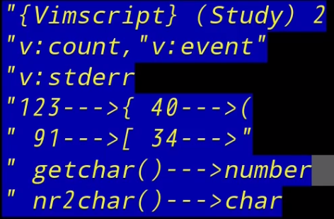

# 手把手教你开发Neovim(Vim)插件—无废话系列之最强文本编辑器应该这么学

[toc]

 

## expr映射修饰和col函数 03:22

```bash
" 按s键可以快速切换行首行尾
" <expr> 表示后面表达式的输出
noremap <expr>s col(".")==1?"$":"0"  
vnoremap <expr>s col(".")==1?"$h":"0"  

" 空格选中尖括号中的字符(大于第10列后,viW)
noremap <expr><space> Test()
function! Test()
	if col(".")>10
		return "viw"
	endif
	return "viW"
endfunction

```


## expr映射进阶用法以及巧用事件变量v:count 05:11




## 循环语句和一个超好用插件功能的简单实现 18:12


## 利用寄存器在insert模式下完成一些复杂脚本功能 06:02


## P5jobstart异步函数使用以及编译多文件工程 13:44


## P6实现代码块补全(snippt completion)和内容


# Vimscript 设置选项


主要有两种选项：布尔选项（值为"on"或"off"）和键值选项。

## 布尔选项

执行如下命令：`:set <name>`打开选项、`:set no<name>`关闭选项。

```

# 显示和关闭行号
set number 
set nonumber

# "切换"布尔选项的值
set number!

#  查看选项当前值
set number?
```

## 键值选项

`numberwidth`选项改变行号的列宽。你可以通过`:set <name>=<value>`命令改变 非布尔选项的选项值，并使用`:set <name>?`命令查看选项的当前值。

```
:set number
:set numberwidth=10
:set numberwidth=4
:set numberwidth?
:set wrap?
:set shiftround?
:set matchtime?
# 一次性设置多个选项
set numberwidth=2
:set nonumber
:set number numberwidth=6
```


# Vimscript 精确映射

目前为止，我们已经使用`map`、`nmap`、`vmap`以及`imap`创建了实用的按键映射。 他们很方便，但是有个缺点。运行下面的命令：

```
:nmap - dd
:nmap \ -
当你按下`\`时，Vim会解释其为`-`。但是我们又映射了`-`！Vim会继续解析`-`为`dd`， 即它会删除整行。
`*map`系列命令的一个缺点就是存在递归的危险
```

## 非递归映射

Vim提供另一组映射命令，这些命令创建的映射在运行时 *不会* 进行递归。运行命令：

```
:nmap x dd
:nnoremap \ x
当你按下`\`时，Vim忽略了`x`的映射，仅按照`x`的默认操作执行。即删除当前光标下的字符 而不是删除整行。
=================================================
每一个`*map`系列的命令都有个对应的`*noremap`命令，
包括：
`noremap`/`nnoremap`、 
`vnoremap`和`inoremap`。这些命令将不递归解释映射的内容。
```

# Vimscript Abbreviations

2018-02-24 16:02 更新

Vim有个称为"abbreviations"的特性，用于insert、replace和 command模式。

紧跟一个abbreviation输入"non-keyword character"后Vim会替换那个abbreviation。

==输入非字母、数字、下划线的字符就会引发abbreviations替换。==

 "non-keyword character"指那些不在`iskeyword`选项中的字符。运行命令：

诸如这样的==输入纠错==是abbreviations的一个很实用的用法。

```bash
:iabbrev adn and
#"在输入`adn`之后输入空格键，Vim会将其替换为`and`。
:iabbrev waht what
:iabbrev tehn then
# 再次进入insert模式并输入：
Well, I don't know waht we should do tehn.
```

## Abbreviations不仅仅只能纠错笔误。日常编辑中常用的abbreviations。 运行如下命令：

```
:iabbrev @@    steve@stevelosh.com
:iabbrev ccopy Copyright 2013 Steve Losh, all rights reserved.
这些abbreviations将你常用的一长串字符压缩至几个字符，省的每次都要那么麻烦。
```

不错，abbreviations和mappings很像，但是他们的定位不同。看个例子：

1. 这次abbreviations只会在需要的时候替换它。

2. mappings不管被映射字符串的前后字符是什么-- 它只在文本中查找指定的字符串并替换他们


# Vimscript 更多的Mappings

```
# Vim将那个单词用双引号包围
nnoremap <leader>" viw<esc>a"<esc>hbi"<esc>lel
```

```
viw<esc>a"<esc>hbi"<esc>lel
```

- `viw`: 高亮选中单词
- `<esc>`: 退出visual模式，此时光标会在单词的最后一个字符上
- `a`: 移动光标至当前位置之 *后* 并进入insert模式
- `"`: 插入一个`"`
- `<esc>`: 返回到normal模式
- `h`: 左移一个字符
- `b`: 移动光标至单词头部
- `i`: 移动光标至当前位置之 *前* 并进入insert模式
- `"`: 插入一个`"`
- `<esc>`: 返回到normal模式
- `l`: 右移一个字符，光标置于单词的头部
- `e`: 移动光标至单词尾部
- `l`: 右移一个字符，置光标位置在第一个添加的引号上

记住：因为我们使用的是`nnoremap`而不是`nmap`，所以尽管你映射了字符序列中的字符 也不会有影响。Vim会将其中的字符按默认功能执行。

## Exercises

像刚才一样创建一个mapping，用单引号而不是双引号。

试试用`vnoremap`添加一个mapping，使其能够用引号将你 *高亮选中* 的文本包裹。 你可能会需要`<`` `和`>`命令，所以先执行`:help `<```看看帮助文档。

将normal模式下的`H`映射为移动到当前行的首部。`h`是左移，所以你可以认为`H`是 “加强版”的`h`、

将normal模式下的`L`映射为移动到当前行的尾部。`l`是右移，所以你可以认为`L`是 “加强版”的`l`、


## 退出模式

```
# 进入normal模式
inoremap jk <esc>
```

```
:inoremap <esc> <nop>
Vim在插入模式下敲击escape按键后执行`<nop>`(no operation)，这样escape按键在插入模式下就无效了。
```

这个命令会告诉ok，现在你就_不得不_使用`jk`这个mapping来退出插入模式了。

# Vimscript 本地缓冲区的选项设置和映射

2018-02-24 16:02 更新

现在我们先花点时间复习一下我们已经谈论过的三个东西：映射（mappings），缩写（abbreviations）和选项设置（options），这个过程中会讲到一些新的东西。我们将在一个单一的缓冲区中同时设置它们。

这一章所讲到的东西会在下一章中真正的显示它们的作用，目前我们只需先打下基础。

在这一章中你需要在Vim中打开两个文件，两个文件是分开的。我先将它们命名为`foo`和`bar`，你可以随便对它们命名。然后为每个文件输入一些文字。

## 映射

选择文件`foo`，然后执行下面的命令：

```
:nnoremap          <leader>d dd
:nnoremap <buffer> <leader>x dd
```

第二个`nnoremap`命令中的`<buffer>`告诉Vim这个映射只在定义它的那个缓冲区中有效：

当你在`bar`文件下敲击`<leader>x`，Vim找不到一个跟它匹配的映射，它将会被解析了两个命令：`<leader>`（这个什么都不会干）和 `x`（通常会删除一个字符）。

## 本地Leader

在这个例子中，`<leader>x`是一个本地缓冲区映射，不过这种定义方式并不合适。如果我们需要设定一个只会用于特定缓冲区的映射，一般会使用`<localleader>`，而不是`<leader>`。

使用两种不同的leader按键就像设置了一种命名空间，这会帮助你保证所有不同的映射对你而言更加清晰直接。

但你在编写一个会被其他人用到的插件的时候，这点显得尤其重要。使用`<localleader>`来设置本地映射会防止你的插件覆盖别人用`<leader>`设置的全局映射，因为他们可能已经对他们做设置的全局映射非常之习惯了。

## 设置

在这本书的前面几个章节里，我们谈论了使用`set`来设置选项。有一些选项总是会适用于整个Vim，但是有些选项可以基于缓冲区进行设置。
切回到文件`foo`，执行下面的命令：
```
:setlocal wrap
:setlocal nowrap
:setlocal number
:setlocal nonumber
```
现在在文件`foo`中会出现行号，而在`bar`则没有。
不是所有的选项都可以使用`setlocal`进行设置。如果你想知道某个特定的选项是否可以设置为本地选项，执行`:help`查看它的帮助文档。

对于本地选项如何_真正地_地工作，我说的有些简略。在练习中你会学到更多这方面的细节。

## 遮盖

本地映射的一个非常有趣的特性

```
:nnoremap <buffer> Q x
:nnoremap          Q dd
当你敲击`Q`，Vim会执行第一个映射，而不是第二个，因为第一个映射比起第二个要显得*更具体*，这可以看成第二个映射被第一个映射遮盖了
```

# Vimscript 本地缓冲区缩写

## 本地缓冲区的缩写。

打开你的`foo`和`bar`这两个文件，切换到`foo`，然后执行下面的命令：

```
:iabbrev <buffer> --- &mdash;
```

在文件`foo`下进入插入模式输入下面的文本：

```
Hello --- world.
```

Vim会为你将`---`替换为“Hello“。现在切换到`bar`试试。在`bar`中替换不会发生，这是因为我们所定义的缩写被设置为只用于`foo`的本地缓冲区。

## 自动命令和缩写

使用本地缓冲区的缩写和自动命令来创建一个简单的“snippet”系统。

执行下面的命令：

```
:autocmd FileType python     :iabbrev <buffer> iff if:<left>
:autocmd FileType javascript :iabbrev <buffer> iff if ()<left>
打开一个Javascript文件然后输入`iff`缩写。然后再打开一个Python文件试试。Vim会依据文件类型在当前行执行合适的缩写。
```

创建更多的针对不同类型的文件的“snippet”缩写。

你可以为绝大多数语言创建`return`的缩写，为javascript创建`function`的缩写，以及为HTML文件创建`“`和`”`的缩写。

记住：最好的学习使用这些snippets的方法是==_禁用_之前你做这些事情的方式==。执行`:iabbrev <buffer> return NOPENOPENOPE`会_强迫_你使用缩写，这个命令在你输入return的时候不会输出任何东西

# Vimscript 自动命令组

```
:autocmd BufWrite * :echom "Writing buffer!"
```

现在使用`:write`命令将当前缓冲区写入文件，然后执行`:messages`命令查看消息日志。你会看到`Writing buffer!`在消息列表中。

```
:autocmd BufWrite * :echom "Writing buffer!"
```

再次将当前缓冲区写入文件并执行`:messages`命令。你会看到`Writing buffer!`在消息列表中出现了_4_次，这是怎么回事？

加载你的`~/.vimrc`文件的时候，Vim会重新读取整个文件，包括你所定义的任何自动命令！这就意味着每次你加载你的`~/.vimrc`文件的时候，Vim都会复制之前的自动命令，这会降低Vim的运行速度，因为它会一次又一次地执行相同的命令。

## 把自动命令放到组中（Grouping Autocommands）

如果你想清除一个组，你可以把`autocmd!`这个命令包含在组里面。执行下面的命令：

```
:augroup testgroup
:    autocmd!
:    autocmd BufWrite * :echom "Cats"
:augroup END
```

# Vimscript Operator-Pending映射

Vim映射系统中另外一个神奇的部分：“Operator-Pending映射”

一个Operator（操作）就是一个命令，你可以在这个命令的后面输入一个Movement（移动）命令，然后Vim开始对文本执行前面的操作命令，这个操作命令会从你当前所在的位置开始执行，一直到这个移动命令会把你带到的位置结束。

常用到的Operator有`d`，`y`和`c`。例如：

```
按键   操作       移动
----   --------   -------------
dw     删除       到下一个单词
ci(    修改       在括号内
yt,    复制       到逗号
```

## Movement映射

Vim允许你创建任何新的movements，这些movements可以跟所有命令一起工作。执行下面的命令：

```
:onoremap p i(
return person.get_pets(type="cat", fluffy_only=True)
`dp`  Vim会删除括号内的所有文字
```
`onoremap`命令会告诉Vim当它在等待一个要附加在operator后面的movement的时候，如果这个movement是`p`的话，它会把它当作`i(`。所以当我们在运行`dp`的时候，就象是在对Vim说“delete parameters”，而Vim会把它理解为“在括号内删除”。

```
:onoremap b /return<cr>
```

现在把下面的文字输入到缓冲区：

```
def count(i):
    i += 1
    print i

    return foo
```

把光标放到第二行的`i`上，然后按下`db`。会发生生么？Vim把整个函数体中直到`return`上面的内容都删除了

1. 在光标所在的位置开始。
2. 进入可视模式(charwise)。
3. ... 把映射的按键放到这里 ...
4. 所有你想包含在movement中的文字都会被选中。

你所要做的工作就是在第三步中填上合适的按键。

## 改变开始位置

定义的movements都是从光标所在的位置开始的话，会限制想使用movement来做的事情。

但是Vim并不会限制你去做你想做的事情

```
:onoremap in( :<c-u>normal! f(vi(<cr>
```

这个命令看起来有些复杂，不过我们还是先试试它能干什么。将下面的文字输入缓冲区：

```
print foo(bar)
```

把光标放到单词`print`上面，然后敲击`cin(`。Vim会删除括号内的内容然后进入插入模式，并且光标会停留在括号的中间。

```
:onoremap il( :<c-u>normal! F)vi(<cr>
```

- `F)`: 向后移动到最近的`)`字符。
- `vi(`: 进入可视模式选择括号内的所有内容。

## 练习

为"around next parentheses"和"around last parentheses"创建operator-pending映射

为打括号创建类似的in/around next/last的mappings。

# Vimscript 更多Operator-Pending映射

Operators和movements所包含的理念是Vim中的一个非常重要的概念，也是Vim之所以这么高效的最大原因所在。

```
Topic One
=========

This is some text about topic one.

It has multiple paragraphs.

Topic Two
=========

This is some text about topic two.  It has only one paragraph.
```

使用`=`作为“下划线”的行会被Markdown当作标题。我们现在创建一些映射，这些映射可以让我们通过movements定位到标题。运行下面的命令：

### cih

```
:onoremap ih :<c-u>execute "normal! ?^==\\+$\r:nohlsearch\rkvg_"<cr>
```

`cih`。Vim会删除光标所在章节的标题，然后保持在插入模式，这可以称为"修改所在的标题(change inside heading)"。

```
:normal! ?^==\+$<cr>:nohlsearch<cr>kvg_
                ^^^^           ^^^^
                 ||             ||
这里的<cr>实际上是一个回车符，而不是由4个字符——“左尖括号”，“c“，”r“和“右尖括号”组成的字符串。
```

- `k`：向上移动一行。第一部分已经将光标定位到了等号符号组成的行的第一个字符，所以执行这个命令后光标就会被定位到标题的第一个字符上。
- `v`：进入可视模式(characterwise)。
- `g_`：移动到当前行的最后一个非空字符上。这里没有使用`$`，是因为`$`会选中换行符号，这不是我们所想要的。

### cah

`cah`,删除标题,删除相连的等号组成的行。“_环绕_这一节的标题(*around* this section's heading)“。

这个映射有什么不同呢？让我们对照之前的映射看一下：

```
:onoremap ih :<c-u>execute "normal! ?^==\\+$\r:nohlsearch\rkvg_"<cr>
:onoremap ah :<c-u>execute "normal! ?^==\\+$\r:nohlsearch\rg_vk0"<cr>
```

唯一的不同是映射的后面用于选择文本的部分：

```
inside heading: kvg_
around heading: g_vk0
```

其他的部分都是一模一样的，所以我们现在从将光标定位到等号组成的行的第一个字符的那个部分开始进行讲解：

- `g_`：移动到当前行（译注：等号组成的行）的最后一个非空字符。
- `v`：进入可视模式(characterwise)。
- `k`：向上移动一行。这会将光标移动到包含标题文字的行上。
- `0`：移动到这一行（译注：标题行）的第一个字符。

在可视模式下同时选中标题的文字和等号组成的行，然后Vim会在这两行上执行相应的操作。

# vimscript 状态条

Vim允许自定义每个窗口底部的状态条显示的文字，你可以通过设置`statusline`选项来进行自定义。执行下面的命令：

```
:set statusline=%f\ -\ FileType:\ %y
```

现在你可以在状态条中看到类似`foo.markdown - FileType: [markdown]`这样的文字。

```
:set statusline=%f         " 文件的路径
:set statusline+=\ -\      " 分隔符
:set statusline+=FileType: " 标签
:set statusline+=%y        " 文件的类型
```

使用`+=`逐渐添加其他要显示的内容，一次添加一条。

```
:set statusline=%l    " 当前行号
:set statusline+=/    " 分隔符
:set statusline+=%L   " 总行数
```

现在状态条只包含当前所在行以及文件的总行数，并且显示成`12/223`这个样子。

## 宽度和边距

可以在`%`后面添加额外的字符来改变状态条中信息的显示样式。执行下面的命令：

```
:set statusline=[%4l]
默认情况下在值的左边添加边距
set statusline=Current:\ %4l\ Total:\ %4L
```

现在状态条中的文件行数会至少显示为4个字符的宽度（例如：`[ 12]`），这可以用于防止状态条中的文字总是令人厌烦地跳来跳去。

使用`-`将边距添加在右边

```
:set statusline=Current:\ %-4l\ Total:\ %-4L
```

对于会被显示为数字的代码，你可以让Vim使用0代替空格来填充边距。执行下面的命令：

```
:set statusline=%04l
```

现在当光标位于第12行的时候你的状态条会显示`0012`。

最后，你可以设置一个代码所要输出的值的最大宽度。执行下面命令：

```
:set statusline=%F
:set statusline=%.20F  `%F`会显示当前文件的_完整_路径。现在执行下面的命令改变最大宽度：
```

## 通用格式

阅读`:help statusline`查看状态条中代码的通用格式：

```
%-0{minwid}.{maxwid}{item}
除了`%`和item外其他都是可选的。
```

## 分割 %= 放到右边

```
:set statusline=%f         " 文件的路径
:set statusline+=%=        " 切换到右边 Vim所有在此之后要在状态条上显示的信息都应该右对齐
:set statusline+=%l        " 当前行
:set statusline+=/         " 分隔符
:set statusline+=%L        " 总行数
```

# Vimscript 变量

```
:let foo = "bar"
:echo foo
```

## 作为变量的选项

你可以通过一种特殊语法将_选项_作为变量来设置。执行下面的命令：

```
:set textwidth=80
:echo &textwidth
```

Vim会显示`80`。在名称的前面加一个==`&`符号是告诉Vim你正在引用这个选项，==而不是在使用一个名称刚好相同的变量。

将整型`0`当作"false"，整型`1`当作"true"。

```
:let &textwidth = 100
:set textwidth?
```

Vim会显示`textwidth=100`。

既然`set`可以搞定选项的设置，那我们为什么还要用`let`呢？执行下面的命令：

```
:let &textwidth = &textwidth + 10
:set textwidth?
```

当你用`set`来设置某个选项，你只能给它设置一个`常量值`。

当你使用`let`并将它作为一个`变量`来设置，你可以使用Vim脚本的所有强大之处来决定它的值。

## 本地选项

如果你想将某个选项作为变量来设置它的_本地_值，而不是_全局_值，你需要在变量名前面加前缀。

```
:let &l:number = 1
```

```
:let &l:number = 0
```

注意第一个窗口会出现行号，而第二个没有。

## 作为变量的寄存器(Register)

你也可以将_寄存器_当作变量来读取和设置。执行下面的命令：

```
:let @a = "hello!"
```

现在把光标放到文本中的某个地方然后敲击`"ap`。这个命令会告诉Vim“在这里粘贴寄存器`a`中的内容”。我们设置了这个寄存器的内容，所以Vim会将`hello!`粘贴到你的文本中。

```
:echo @a
Vim会输出`hello!`。
```

在你的文件中选择一个单词然后用`y`复制，再执行下面的命令：

```
:echo @"
```

Vim会输出你刚才复制的单词。`"`寄存器是“未命名(unnamed)”寄存器，在复制的时候没有指定寄存器的文本都会放到这里。

在你的文件中执行搜索`/someword`，然后执行下面的命令：

```
:echo @/
```

Vim会输出你刚刚使用的搜索模式。这样你就可以通过编程来读_和修改_当前的搜索模式，有些时候这会很有用。

## 练习

检查你的`~/.vimrc`文件，然后将其中的一些`set`和`setlocal`命令替换为它们的`let`形式。记住布尔选项仍然需要被设置为某个值。

# Vimscript 条件语句

2018-02-24 16:02 更新

每种编程语言都有产生分支流程的方法，在Vimscript中，这是用`if`语句实现的。 `if`语句是Vimscript中产生分支的基本方法。这里没有类似Ruby中的`unless`语句， 所以代码中所有的判断都需要用`if`实现。

在谈论Vim的`if`语句之前，我们需要花费额外的时间讲讲语法，这样可以在同一页里讲完它。

## 多行语句

有时你在一行里写不下所需的Vimscript。在讲到自动命令组时，我们已经遇到过这样的例子了。 这里是我们之前写过的代码：

```
:augroup testgroup
:    autocmd BufWrite * :echom "Baz"
:augroup END
```

在理想的情况下，你可以分开成三行来写。但在手工执行命令的时候，这样写就太冗长了。 其实，你可以用管道符(`|`)来隔开每一行。执行下面的命令：

```
:echom "foo" | echom "bar"
```

Vim会把它当作两个独立的命令。如果你看不到两行输出，执行`:messages`查看消息日志。

在本书的剩余部分，当你想手工执行一个命令，却对输入新行和冒号感到心烦时，试试用管道隔开， 在一行里写完。

## If的基本用法

现在让我们回到正题上来，执行下面的命令：

```
:if 1
:    echom "ONE"
:endif
```

Vim将显示`ONE`，因为整数`1`是"truthy"。现在执行下面命令：

```
:if 0
:    echom "ZERO"
:endif
```

Vim将_不_显示`ZERO`，因为整数`0`是"falsy"。让我们看看对字符串是怎么处理的。执行下面命令：

```
:if "something"
:    echom "INDEED"
:endif
```

结果可能让你吃惊。Vim_不会_把非空字符串当作"truthy"，所以什么也没有显示。

让我们打破沙锅问到底。执行下面的命令：

```
:if "9024"
:    echom "WHAT?!"
:endif
```

这次Vim_会_显示了！为什么会这样？

为了搞懂发生了什么，执行下面三个命令：

```
:echom "hello" + 10
:echom "10hello" + 10
:echom "hello10" + 10
```

第一个命令使得Vim输出`10`，第二个命令输出`20`，第三个则又一次输出`10`！

在探究了所有的命令后，对于Vimscript我们可以得出结论：

- 如有必要，Vim将强制转换变量(和字面量)的类型。在解析`10 + "20foo"`时，Vim将把`"20foo"`转换成一个整数(`20`)然后加到`10`上去。
- 以一个数字开头的字符串会被强制转换成数字，否则会转换成`0`
- 在所有的强制转换完成*后*，当`if`的判断条件等于非零整数时，Vim会执行`if`语句体。

## Else 和 Elseif

Vim，像Python一样，支持"else"和"else if"分句。执行下面的命令：

```
:if 0
:    echom "if"
:elseif "nope!"
:    echom "elseif"
:else
:    echom "finally!"
:endif
```

Vim输出`finally!`，因为前面的判断条件都等于0，而0代表falsy。

## 练习

来一杯啤酒，安抚自己因Vim中的字符串强制转换而受伤的心。

# Vimscript 执行normal!

2018-02-24 16:02 更新

既然已经学了`execute`和`normal!`，我们就可以深入探讨一个Vimscript惯用法。 执行下面的命令：

```
:execute "normal! gg/foo\<cr>dd"
```

这将移动到文件的开头，查找`foo`的首次出现的地方，并删掉那一行。

之前我们尝试过用`normal!`来执行一个搜索命令却无法输入必须的回车来开始进行搜索。 结合`execute`和`normal!`将解决这个问题。

`execute`允许你创建命令，因而你能够使用Vim普通的转义字符串来生成你需要的"打不出"的字符。 尝试下面的命令：

```
:execute "normal! mqA;\<esc>`q"
```

这个命令做了什么？让我们掰开来讲：

- `:execute "normal! ..."`：执行命令序列，一如它们是在normal模式下输入的，忽略所有映射， 并替换转义字符串。
- `mq`：保存当前位置到标记"q"。
- `A`：移动到当前行的末尾并在最后一个字符后进入insert模式。
- `;`：我们现在位于insert模式，所以仅仅是写入了一个";"。
- `\<esc>`：这是一个表示Esc键的转义字符串序列，把我们带离insert模式。
- ``q`：回到标记"q"所在的位置。

看上去有点绕，不过它真的很有用：==它在当前行的末尾补上一个分号并保持光标不动==。 在写Javascript，C或其他以分号作为语句分隔符的语言时，一旦忘记加上分号，这样的映射将助你一臂之力。

# Vimscript 旧社会下的插件配置方式

2018-02-24 16:02 更新

我们需要讲到的第一件事是如何配置我们的插件。在过去，这会是一次混乱的折腾， 但现在我们有一个工具可以非常方便地安装Vim插件。

我们需要先过一下基本的配置方式，然后我们会讲到如何省下麻烦。

## 基本配置方式

Vim支持把插件分割成多个文件。你可以在`~/.vim`下创建许多不同种类的文件夹来放置不同的内容。

我们现在将讲述其中最为重要的几个文件夹，但不会在上面花费太多时间。 当我们创造Potion插件时，我们会逐一认识它们的。

在我们继续前进之前，需要先确定一些用词规范。

我将用"插件"表示一大堆做一系列相关事情的Vimscript代码。 在Vim里，"插件(plugin)"有一个更专业的定义，它表示"`~/.vim/plugins/`下的一个文件"。

在大多数时间里，我将使用第一个定义。如果指的是第二个定义，我会特意指明。

## ~/.vim/colors/

Vim将会查找`~/.vim/colors/mycolors.vim`并执行它。 这个文件应该包括生成你的配色方案所需的一切Vimscript命令。

本书中，我们不会谈到配色方案。如果想创造属于自己的配色方案，你应该从一个现存的配色方案上改造出来。 记住，`:help`将与你常在。

## ~/.vim/plugin/

`~/.vim/plugin/`下的文件将在_每次_Vim启动的时候执行。 这里的文件包括那些无论何时，在启动Vim之后你就想加载的代码。

## ~/.vim/ftdetect/

`~/.vim/ftdetect/`下的文件在每次你启动Vim的时候_也会_执行。

`ftdetect`是"filetype detection"的缩写。 这里的文件_仅仅_负责启动检测和设置文件的`filetype`类型的自动命令。 这意味着它们一般不会超过一两行。

## ~/.vim/ftplugin/

`~/.vim/ftplugin/`下的文件则各不相同。

一切皆取决于它的名字!当Vim把一个缓冲区的`filetype`设置成某个值时， 它会去查找`~/.vim/ftplugin/`下对应的文件。 比如：如果你执行`set filetype=derp`，Vim将查找`~/.vim/ftplugin/derp.vim`。 一旦文件存在，Vim将执行它。

Vim也支持在`~/.vim/ftplugin/`下放置文件夹。 再以我们刚才的例子为例：`set filetype=derp`将告诉Vim去执行`~/.vim/ftplugin/derp/`下的全部`*.vim`文件。 这使得你可以按代码逻辑分割在`ftplugin`下的文件。

因为每次在一个缓冲区中执行`filetype`时都会执行这些文件，所以它们_只能_设置buffer-local选项！ 如果在它们中设置了全局选项，所有打开的缓冲区的设置都会遭到覆盖！

## ~/.vim/indent/

`~/.vim/indent/`下的文件类似于`ftplugin`下的文件。加载时也是只加载名字对应的文件。

`indent`文件应该设置跟对应文件类型相关的缩进，而且这些设置应该是buffer-local的。

是的，你当然可以把这些代码也一并放入`ftplugin`文件， 但最好把它们独立出来，让其他Vim用户理解你的意图。这只是一种惯例，不过请尽量体贴用户并遵从它。

## ~/.vim/compiler/

`~/.vim/compiler`下的文件非常类似于`indent`文件。它们应该设置同类型名的当前缓冲区下的编译器相关选项。

不要担心不懂什么是"编译器相关选项"。我们等会会解释。

## ~/.vim/after/

`~/.vim/after`文件夹有点神奇。这个文件夹下的文件会在每次Vim启动的时候加载， 不过是在`~/.vim/plugin/`下的文件加载了*之后*。

这允许你覆盖Vim的默认设置。实际上你将很少需要这么做，所以不用理它， 除非你有"Vim设置了选项`x`，但我想要不同的设置"的主意。

## ~/.vim/autoload/

`~/.vim/autoload`文件夹就更加神奇了。事实上它的作用没有听起来那么复杂。

简明扼要地说：`autoload`是一种延迟插件代码到需要时才加载的方法。 我们将在重构插件的时候详细讲解并展示它的用法。

## ~/.vim/doc/

最后，`~/.vim/doc/`文件夹提供了一个你可以放置你的插件的文档的地方。 Vim对文档的要求是多多益善(看看我们执行过的所有`:help`命令就知道)，所以为你的插件写文档是重要的。

## 练习

重读本章。我没开玩笑。确保你(大体上)明白我们讲过的每一个文件夹。

作为额外的加分，找一些你正在用的Vim插件看看它们如何组织代码文件。

# Vimscript 基本折叠

2018-02-24 16:03 更新

如果从未在Vim里使用过代码折叠，你不知道你都错过了什么。 阅读`:help usr_28`并花费时间在日常工作中使用它。 一旦到了铭记于指的程度，你就可以继续本章了。

## 折叠类型

Vim支持六种不同的决定如何折叠你的文本的折叠类型。

### Manual

你手动创建折叠并且折叠将被Vim储存在内存中。 当你关闭Vim时，它们也将一并烟消云散，而下次你编辑文件时将不得不重新创建。

在你把它跟一些自定义的创建折叠的映射结合起来时，这种方式会很方便。 在本书中，我们不会这么做，但当你想这么做的时候，它会帮上忙。

### Marker

Vim基于特定的字符组合折叠你的代码。

这些字符通常放置于注释中(比如`// {{{`)， 不过在有些语言里，你可以使用该语言自己的语法代替，比如javascript的`{`和`}`。

纯粹为了你的编辑器，用注释割裂你的代码看上去有点丑，但好处是你可以定制特定的折叠。 如果你想以特定的方式组织一个大文件，这个类型将是非常棒的选择。

### Diff

在diff文件时使用该特定的折叠类型。我们不会讨论它，因为Vim会自动使用它。

### Expr

这让你可以用自定义的Vimscript来决定折叠的位置。它是最为强大的方式，不过也需要最繁重的工作。 下一章我们将讲到它。

### Indent

Vim使用你的代码的缩进来折叠。同样缩进等级的代码折叠到一块，空行则被折叠到周围的行一起去。

这是最便捷的方式，因为你的代码已经缩进过了；你仅仅需要启动它。 这将是我们用来折叠Potion代码的第一种方式。

## Potion折叠

让我们再一次看一下Potion实例代码：

```
factorial = (n):
    total = 1
    n to 1 (i):
        total *= i.
    total.

10 times (i):
    i string print
    '! is: ' print
    factorial (i) string print
    "\n" print.
```

函数体和循环体已经缩进好了。这意味着我们可以不怎么费力就能实现一些基本的缩进。

在我们开始之前，在`total *= i`上添加一个注释，这样我们就有一个供测试的多行内部块。 你将在做练习的时候学到为什么我们需要这么做，但暂时先信任我。现在文件看上去就像这样：

```
factorial = (n):
    total = 1
    n to 1 (i):
        # Multiply the running total.
        total *= i.
    total.

10 times (i):
    i string print
    '! is: ' print
    factorial (i) string print
    "\n" print.
```

在你的Potion插件的版本库下创建一个`ftplugin`文件夹，然后在里面创建一个`potion`文件夹。 最后，在_`potion`文件夹_里面创建一个`folding.vim`文件。

不要忘了每次Vim设置一个buffer的`filetype`为`potion`时，它都会执行这个文件中的代码。 (因为它位于一个叫`potion`的文件夹)

将所有的折叠相关的代码放在同一个文件显然是一个好主意，它能帮我们维护我们的插件的繁多的功能。

在这个文件中加入下面一行：

```
setlocal foldmethod=indent
```

关闭Vim，重新打开`factoria.pn`。用`zR`，`zM`和`za`尝试折叠功能。

一行Vimscript代码就能带来一些有用的折叠！这真是太酷了！

你可能注意到`factorial`函数的内循环里面的那几行不能折叠，尽管它们缩进了。 为什么会这样？

事实上，在使用`indent`折叠时，Vim默认忽略以`#`字符开头的行。 这在编辑C文件时很有用(这时`#`表示一个预编译指令)，但在编辑其他文件时不怎么有意义。

让我们在`ftplugin/potion/folding.vim`中添加多一行来修复问题：

```
setlocal foldmethod=indent
setlocal foldignore=
```

关闭并重新打开`factorial.pn`，现在内部块可以正常地折叠了。

## 练习
