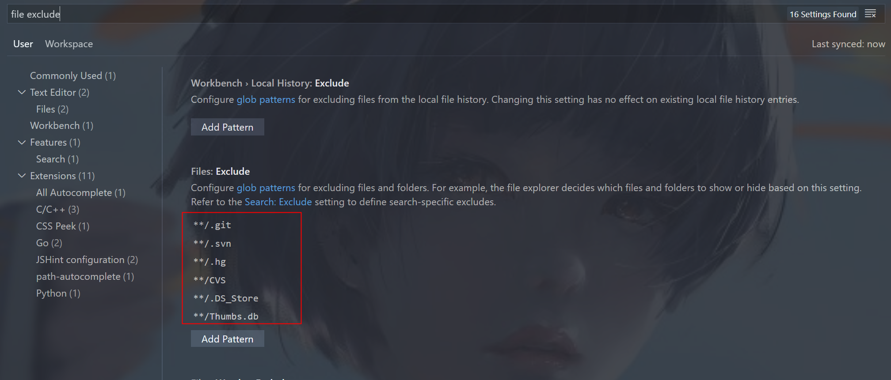

# vscode配置git-bash终端作为默认终端


**首先参考[博客](https://gitlab.mheartcube.com/hydf/management-fe.git)，旧的vscode可以配置成功，但是下载的新版的vscode没有这个`shell.windows`配置项，采用以下方法解决**
参考[vscode官方文档](https://code.visualstudio.com/docs/editor/integrated-terminal#_configuration)，文档中有一段是

> Profiles can be created using either a path or a source, as well as a
> set of optional arguments. A source is available only on Windows and
> can be used to let VS Code detect the install of either PowerShell or
> Git Bash. Alternatively a path pointing directly to the shell
> executable can be used.
> 大概意思就是配置source后者path，source仅在Windows有效且自动**检测**是否安装其他终端，path则是直接指定终端位置即可用

所以直接修改profiles.windows配置，新版的配置中不能使用`shell.windows`，但提供了`automationShell.windows`，说是可以override `shell.windows`的配置，同时要配置上`git.path`，不然会报错。使用`defaultProfile.windows`设置默认终端，配置如下：

```
{
    "terminal.integrated.profiles.windows": {
        "PowerShell": {
            "source": "PowerShell",
            "icon": "terminal-powershell"
        },
        "Command Prompt": {
            "path": [
                "${env:windir}\\Sysnative\\cmd.exe",
                "${env:windir}\\System32\\cmd.exe"
            ],
            "args": [],
            "icon": "terminal-cmd"
        },
        "Git-Bash": {
            "path": "D:\\Git\\Git\\bin\\bash.exe"
        }
    },
    "terminal.integrated.automationShell.windows": "‪D:\\Git\\Git\\bin\\bash.exe",
    "git.path": "‪D:\\Git\\Git\\bin\\git.exe",
    "terminal.integrated.defaultProfile.windows": "Git-Bash",
}
12345678910111213141516171819202122
```

## 显示临时文件

