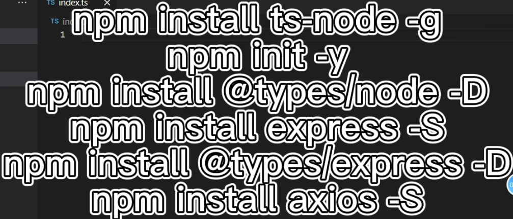
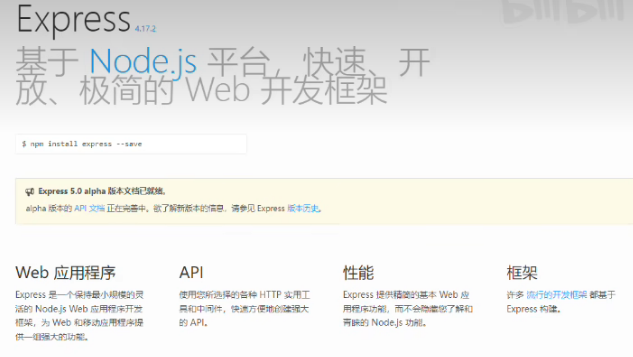
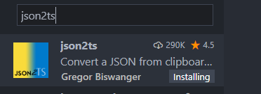
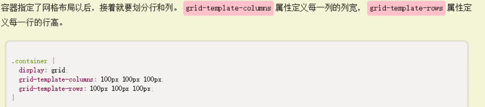

# 接口API

[toc]


## ts执行插件安装



## express



node.js中的express的Router路由的使用，作用是为了更好的根据路由去分模块，避免将所有的路由都写在入口文件中

## 初始化前端

```vue
npm init vue@latest
cd vue-yiqing-view
  npm install
  npm run dev
# 安装less
npm install less less-loader -D
npm install axios -S
npm install echarts -S
npm install animate.css -S //动画
```

### json2ts解决复杂json数据，实例化为js对象的问题




## 动画

```vue
import 'animate.css'
```


