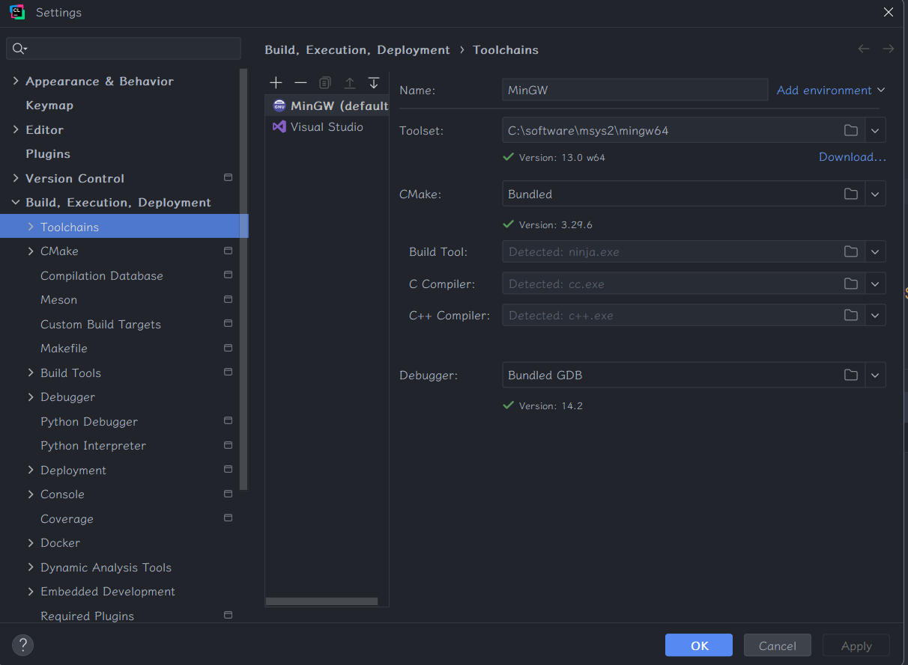
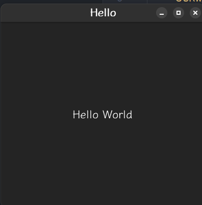
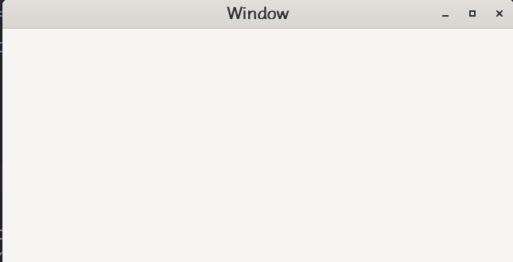
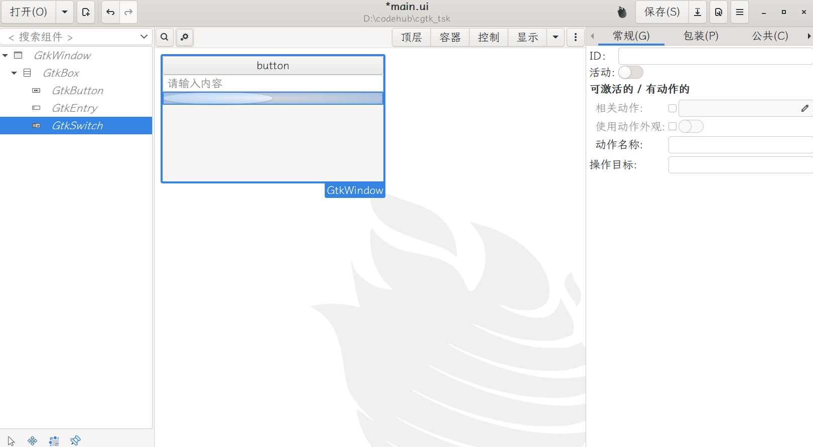
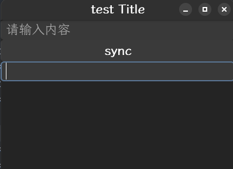
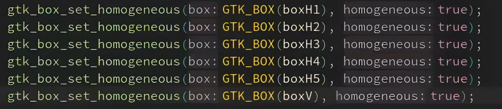
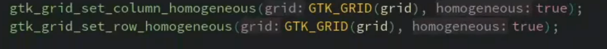

# windows下gtk4开发

[toc]


上接搭建windows GTK环境+pyGTK使用一文

正式开始开发，安装clion

## toolchains选择mingw64



##   cmake配置 CMakeLists.txt

```txt
cmake_minimum_required(VERSION 3.29)
project(cgtk_tsk C)

set(CMAKE_C_STANDARD 23)

find_package(PkgConfig REQUIRED)
pkg_check_modules(GTK4 REQUIRED gtk4)

include_directories(${GTK4_INCLUDE_DIRS})
link_directories(${GTK4_LIBRARY_DIRS})


add_executable(cgtk_tsk main.c)
target_link_libraries(cgtk_tsk ${GTK4_LIBRARIES})
```
## cmake的libadwaita支持  扁平话主题

案例 https://gnome.pages.gitlab.gnome.org/libadwaita/doc/1-latest/initialization.html

添加libadwaita

```bash
pkg_check_modules(ADWAITA libadwaita-1 REQUIRED)  ## 
target_link_libraries(cgtk_tsk ${GTK4_LIBRARIES} ${ADWAITA_LIBRARIES})  ##
```

```c
#include <gtk/gtk.h>
#include <libadwaita-1/adwaita.h>

static void
activate_cb(GtkApplication *app) {
    GtkWidget *window = gtk_application_window_new(app);
    GtkWidget *label = gtk_label_new("Hello World");

    gtk_window_set_title(GTK_WINDOW(window), "Hello");
    gtk_window_set_default_size(GTK_WINDOW(window), 400, 400);
    gtk_window_set_child(GTK_WINDOW(window), label);
    gtk_window_present(GTK_WINDOW(window));
}

int
main(int argc, char *argv[]) {
    g_autoptr(AdwApplication) app = NULL;

    app = adw_application_new("org.example.Hello", G_APPLICATION_FLAGS_NONE);
    g_signal_connect(app, "activate", G_CALLBACK (activate_cb), NULL);
    return g_application_run(G_APPLICATION(app), argc, argv);
}
```




## demo

### demo1 hello world

https://docs.gtk.org/gtk4/getting_started.html

```c
#include <gtk/gtk.h>

static void
activate (GtkApplication* app,
          gpointer        user_data)
{
    GtkWidget *window = gtk_application_window_new(app);
    gtk_window_set_title (GTK_WINDOW (window), "Window");
    gtk_window_set_default_size (GTK_WINDOW (window), 200, 200);
    gtk_window_present (GTK_WINDOW (window));
}

int
main (int    argc,
      char **argv)
{
    GtkApplication *app = gtk_application_new("org.gtk.example", G_APPLICATION_DEFAULT_FLAGS);
    g_signal_connect (app, "activate", G_CALLBACK (activate), NULL);
    const int status = g_application_run(G_APPLICATION(app), argc, argv);
    g_object_unref (app);

    return status;
}

```

然后运行


### demo2 显示时间

https://docs.gtk.org/glib/?q=time  glib接口

https://docs.gtk.org/glib/func.get_real_time.html

```c
#include <gtk/gtk.h>
#include <glib/gprintf.h>
#include <libadwaita-1/adwaita.h>

static void active_refresh_time(GtkButton *button, GtkEntryBuffer *raw_data) {
    const int64_t time_now = g_get_real_time();
    GDateTime *now = g_date_time_new_now_local();
    const gchar *formatted = g_date_time_format(now, "%Y-%m-%d %H:%M:%S");
    gtk_entry_buffer_set_text(raw_data, formatted, strlen(formatted));
}

static void
activate_cb(GtkApplication *app) {
    GtkWidget *window = gtk_application_window_new(app);
    gtk_window_set_title(GTK_WINDOW(window), "test Title");
    gtk_window_set_default_size(GTK_WINDOW(window), 400, 400);

    // GtkWidget *label = gtk_label_new("Hello World");
    GtkWidget *refresh_time = gtk_button_new_with_label("点击");
    GtkEntryBuffer *raw_data = gtk_entry_buffer_new(NULL, 0);
    g_signal_connect(refresh_time, "clicked", G_CALLBACK (active_refresh_time), raw_data);

    GtkWidget *output = gtk_text_new_with_buffer(raw_data);

    GtkWidget *box = (gtk_box_new(GTK_ORIENTATION_VERTICAL, 10));

    gtk_box_append(GTK_BOX(box), output);
    gtk_box_append(GTK_BOX(box), refresh_time);

    // gtk_window_set_child(GTK_WINDOW(window), label);
    gtk_window_set_child(GTK_WINDOW(window), box);
    gtk_window_present(GTK_WINDOW(window));
}


int
main(const int argc, char *argv[]) {
    g_autoptr(AdwApplication) app = NULL;

    app = adw_application_new("com.github.linruohan", G_APPLICATION_FLAGS_NONE);
    g_signal_connect(app, "activate", G_CALLBACK (activate_cb), NULL);
    return g_application_run(G_APPLICATION(app), argc, argv);
}

 
```


## glade 可视化UI编辑工具

https://packages.msys2.org/package/mingw-w64-x86_64-glade

glade是一个RAD（rapid application  develop，快速应用开发）工具，能够为gtk+工具包和gnome桌面环境快速而简单地开发用户界面。Glade中设计的用户界面保存为XML，通过使用GtkBuilder GTK +对象，应用程序可以根据需要动态加载这些界面。通过使用GtkBuilder，Glade XML文件可以用于多种编程语言，包括C，C  ++，C＃，Vala，Java，Perl，Python等。Glade是根据GNU GPL许可证发布的自由软件。

```bash
# 是支持gtk3的，gtk4需要进行手动升级
pacman -S mingw-w64-x86_64-glade
# 安装好后
C:\software\msys2\mingw64\bin\glade.exe
```


创建顶层，保存到项目路径下，简单设计一下



### 将gtk3xml转为gtk4： gtk4-builder-tool

https://runebook.dev/zh/docs/gtk/gtk4-builder-tool

https://gitlab.gnome.org/GNOME/gtk/-/issues/3534 ` gtk4-builder-tool simplify --3to4 --replace ./ui.glade`

C:\software\msys2\mingw64\bin\gtk4-builder-tool.exe


### glade demo

```c
#include <gtk/gtk.h>
#include <glib/gprintf.h>
#include <libadwaita-1/adwaita.h>

static void active_refresh_time(GtkButton *button, GtkEntryBuffer *raw_data) {
    const int64_t time_now = g_get_real_time();
    GDateTime *now = g_date_time_new_now_local();
    const gchar *formatted = g_date_time_format(now, "%Y-%m-%d %H:%M:%S");
    gtk_entry_buffer_set_text(raw_data, formatted, strlen(formatted));
}

static void
activate(GtkApplication *app) {
    GtkBuilder *builder = gtk_builder_new_from_file("../ui.glade");
    GObject *window = gtk_builder_get_object(builder, "main_window");
    gtk_window_set_application(GTK_WINDOW(window), app);


    gtk_window_set_title(GTK_WINDOW(window), "test Title");
    gtk_window_set_default_size(GTK_WINDOW(window), 400, 400);

    gtk_window_present(GTK_WINDOW(window));
}


int
main(const int argc, char *argv[]) {
    g_autoptr(AdwApplication) app = NULL;

    app = adw_application_new("com.github.linruohan", G_APPLICATION_FLAGS_NONE);
    g_signal_connect(app, "activate", G_CALLBACK (activate), NULL);
    return g_application_run(G_APPLICATION(app), argc, argv);
}


```



### glade自动信号处理


clang-format –style=“WebKit” –dump-config > .clang-format

设置gbox容器里面子部件自动扩展大小



grid 网格布局


