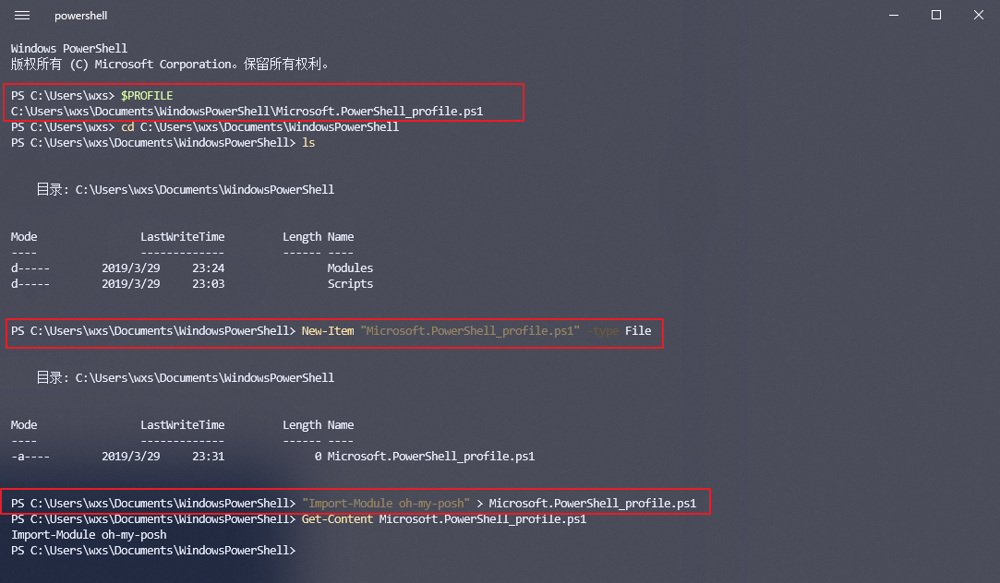

## 1 ⚔️ Windows 命令行自动补全方案速览

| 方案                  | 适用环境                          | 核心补全能力                                                                                                                                                                       | 其他亮点                                                                                     | 配置难度      |
| ------------------- | ----------------------------- | ---------------------------------------------------------------------------------------------------------------------------------------------------------------------------- | ---------------------------------------------------------------------------------------- | --------- |
| **CMD 自带补全**        | 命令提示符 (cmd.exe)               | 基础的路径/文件名补全。                                                                                                                                                                 | 原生支持，但功能简陋，无历史命令预测。                                                                      | 低 (需改注册表) |
| **PowerShell 智能补全** | Windows Terminal (PowerShell) | 菜单式补全、历史命令搜索与预测、智能参数提示[](https://blog.csdn.net/weixin_29214691/article/details/158225607)。                                                                                   | 官方现代 Shell，功能强大，语法高亮[](https://blog.csdn.net/combination1379/article/details/147615020)。 | 低 (启用模块)  |
| **Clink 增强**        | 命令提示符 (cmd.exe)               | 类 Bash 补全、命令/参数/路径/环境变量等[](https://www.cnblogs.com/ghimi/p/19359583#commentform)。                                                                                            | 让 CMD "起死回生"，轻量级，支持历史记录持久化[](https://www.cnblogs.com/ghimi/p/19359583#commentform)。      | 低 (安装即用)  |
| **集成终端**            | Cmder 等终端                     | 集成上述方案，提供开箱即用的体验[](https://developer.baidu.com/article/detail.html?id=6965926)。                                                                                              | 多标签页、分屏、内置 Git 工具[](https://developer.baidu.com/article/detail.html?id=6965926)。         | 低 (下载解压)  |
| **三方通用工具**          | 各 Shell 环境                    | Carapace-bin 提供跨平台的通用补全[](https://blog.gitcode.com/f385b8df1f88c38ed11f92ac1eb3c636.html)；scoop 专为包管理提供补全[](https://blog.gitcode.com/f38d5fa9ccafb0b5223c78375a3eaf1c.html)。 | 跨平台、针对性强。                                                                                | 中 (取决于工具) |

| 特性维度          | Carapace                                                                                      | Clink                                                                                 | inshellisense                                                                                  |
| ------------- | --------------------------------------------------------------------------------------------- | ------------------------------------------------------------------------------------- | ---------------------------------------------------------------------------------------------- |
| **核心定位**      | 跨Shell的通用补全引擎                                                                                 | Windows下CMD.exe增强工具                                                                   | IDE风格智能补全，支持超600个工具[](https://www.npmjs.com/package/@microsoft/inshellisense?ref=pkgstats.com) |
| **工作机制**      | 外部补全器，连接Shell与补全库[](https://vluv.space/nu_completion/#more)                                   | 注入GNU Readline库，增强CMD本身[](https://blog.csdn.net/LongL_GuYu/article/details/140108160) | 中介桥接，读取键入内容，解析并提供建议                                                                            |
| **主要补全范围**    | **命令、参数、文件路径**；支持Go/Cobra生态[](https://blog.gitcode.com/04843da2608b97f3920830a6fa36520f.html) | **文件、目录**；可通过Lua扩展[](https://baohuiming.net/post/cmd-clink)                           | **命令及其子命令、参数、选项**[](https://wangchujiang.com/quick-rss/issue/224.html)                         |
| **优势亮点**      | 灵活性/扩展性极高；补全逻辑精准；性能优异                                                                         | **为CMD带来Bash体验**；轻量易部署                                                                | 智能程度极高；**背靠600+工具库**；跨平台性好                                                                     |
| **局限性**       | 配置相对复杂                                                                                        | **依赖Lua扩展**增加复杂性；补全能力有限                                                               | **依赖Node.js**；资源开销或比前两者高[](https://juejin.cn/post/7299356168882421775)                         |
| **最佳搭档/应用场景** | Nushell、Fish等现代Shell的“外挂”[](https://vluv.space/nu_completion/#more)                           | 必须使用CMD环境；Clink+PowerShell双修                                                          | 追求极致便捷；依赖Node.js；任何兼容Shell                                                                     |
| **命令行建议测试**   | 强                                                                                             | 中                                                                                     | 强                                                                                              |

### 1.1 inshellisense IDE风格的命令行补全
 https://github.com/microsoft/inshellisense
 ```bash
## 安装
npm install -g @microsoft/inshellisense
echo "[ -f ~/.inshellisense/init/bash/init.sh ] && source ~/.inshellisense/init/bash/init.sh" >> ~/.bashrc
is init bash
## 卸载
npm uninstall -g @microsoft/inshellisense
rm -rf ~/.inshellisense
bashrc中删除那一行就像
 ```

### 1.2 📌 原生方案一：让传统 CMD 重获新生 (Clink)

如果你习惯了 **CMD** 的简洁，但又想要现代化的功能，**Clink** 就是完美的解决方案。它能为 CMD 注入 **GNU Readline** 库的强大功能，提供类似 Linux 终端的体验[](https://www.cnblogs.com/ghimi/p/19359583#commentform)。

- **如何获取**：
    - 从 [Clink 官方 GitHub 仓库](https://github.com/chrisant996/clink/releases) 下载 `.msi` 安装包[](https://www.cnblogs.com/ghimi/p/19359583#commentform)。
    - 安装时，记得勾选 **"Autorun when cmd.exe starts"**，确保每次打开 CMD 都能自动加载[](https://blog.csdn.net/Javachichi/article/details/147165680)。
- **核心技巧**：
    - **智能补全**：输入命令、路径，甚至环境变量的一部分，然后按 **`Tab`** 键，Clink 就会列出所有可能选项[](https://blog.csdn.net/Javachichi/article/details/147165680)。补全时还支持通配符，例如输入 `*.txt` 并按 `Tab` 键，能列出所有匹配的文本文件。
    - **历史记录检索**：使用快捷键 **`Ctrl+R` / `Ctrl+S`** 进行模糊搜索，快速找回历史命令[](https://blog.csdn.net/Javachichi/article/details/147165680)。按 **`PgUp` / `PgDn`** 则可基于当前输入的前缀进行筛选[](https://blog.csdn.net/Javachichi/article/details/147165680)。
    - **自定义补全**：Clink 支持使用 **Lua 脚本**编写高级补全规则，甚至可以补全注册表路径等复杂内容[](https://www.cnblogs.com/ghimi/p/19359583#commentform)。例如，`clink set match.expand_envvars true` 命令可启用环境变量补全。
#### 1.2.1 手动安装
- 下载便携包：在Releases页面下载便携版压缩包（64位选择“clink.x64.zip”，32位选择“clink.x86.zip”）。
- 解压压缩包：将下载的.zip文件解压到任意目录（如“D:\Tools\Clink”），解压后包含“clink.exe”等核心文件。
- 手动启动Clink：打开cmd窗口，切换到Clink解压目录，执行命令“clink inject”，即可将Clink注入当前cmd窗口；或直接双击“clink.exe”，会自动打开一个加载了Clink的cmd窗口。
- 设置自动启动（可选）：若需要便携版自动启动，可创建“clink inject”的快捷方式，将其放入Windows启动目录（Win+R输入“shell:startup”打开），这样每次开机启动cmd时会自动加载Clink。
```bash
clink inject # 注入当前窗口
```
### 1.3 🚀 原生方案二：启用 CMD 自带的文件与目录补全
如果你暂时不想安装任何工具，只想让 CMD 能补全文件/目录名，可以通过修改注册表实现。
1. 按 `Win + R`，输入 `regedit` 并回车，打开注册表编辑器[](https://bbs.huaweicloud.com/blogs/347011)。
2. 导航至 `HKEY_LOCAL_MACHINE\SOFTWARE\Microsoft\Command Processor`。
3. 在右侧窗口中，找到 **`CompletionChar`** 项，双击后将**数值数据**改为 **9**（十进制），然后确定。
    - _注：如果键值不存在，可右键 → 新建 → DWORD (32位) 值，命名为 `CompletionChar`。_
4. 重启 CMD 生效。此后，输入部分文件名并按 `Tab` 键即可循环补全[](https://bbs.huaweicloud.com/blogs/347011)。

此方法仅支持文件和文件夹名补全，无法补全命令、参数或环境变量。

### 1.4 ⚡️ 进阶方案三：打造现代化 PowerShell 体验
对于追求极致效率的用户，PowerShell 是 Windows 首选的现代 Shell。
#### 1.4.1 核心组件：PSReadLine
**PSReadLine** 是微软官方的 PowerShell 模块，是实现智能补全的核心[](https://blog.csdn.net/weixin_29214691/article/details/158225607)。
- **安装**：以**管理员身份**打开 PowerShell，执行以下命令。
    powershell
    Install-Module -Name PSReadLine -AllowClobber -Force
- **核心功能**：
    - **智能预测**：输入时，命令行会以灰色字体**实时预测**可能的完整命令。按方向键 **`→`** 即可补全[](https://iknowledge.lenovo.com.cn/detail/439217?type=0&keyword=&keyWordId=)。通过以下命令启用**历史记录**作为预测源：
        powershell
        Set-PSReadLineOption -PredictionSource History
    - **菜单式补全**：输入部分命令后按 **`Tab`** 键，会弹出一个菜单，通过**上下箭头**选择后按 `Enter` 确认[](https://blog.csdn.net/weixin_29214691/article/details/158225607)。
#### 1.4.2 终极组合：美化与扩展

将 PSReadLine 与其他模块搭配，能获得接近 Mac iTerm2 + zsh 的体验[](https://blog.csdn.net/weixin_28595749/article/details/160427667)。
- **posh-git**：在 PowerShell 中提供 Git 状态信息和命令补全，极大方便 Git 用户[](https://blog.csdn.net/combination1379/article/details/147615020)。
    powershell
    Install-Module posh-git
    Install-Module PSCompletions
- **oh-my-posh**：强大的提示符美化工具，提供上百种主题，让终端更具可读性[](https://blog.csdn.net/combination1379/article/details/147615020)。安装后需在 PowerShell 配置文件中初始化：
    powershell
   
```powershell
#  Install-Module oh-my-posh  这个不行换 下面的
Set-ExecutionPolicy Bypass -Scope Process -Force; Invoke-Expression ((New-Object System.Net.WebClient).DownloadString('https://ohmyposh.dev/install.ps1'))
oh-my-posh --version # 验证完成安装
29.13.1
```
首先通过 `$PROFILE` 命令，读取了默认的配置文件路径。如果你直接没有配置过，那么这个文件大概率是不存在的。
首先通过 `cd` 命令进入到配置文件所在文件夹下，然后通过 `ls` 查看文件夹下所有文件，发现文件不存在。
通过 `New-Item` 命令创建该配置文件，然后通过管道流往配置文件中写入 `Import-Module oh-my-posh`。
通过 `Get-Content` 命令查看文件，验证内容的确写入。
```powershell
Import-Module scoop-completion
Import-Module oh-my-posh
oh-my-posh init pwsh --config "$env:POSH_THEMES_PATH\jandedobbeleer.omp.json" | Invoke-Expression
```
    
#### 1.4.3 自定义补全（高级）

如果你有特定需求，还可以为自定义命令或脚本**注册参数补全器**。
- **`Register-ArgumentCompleter`**：一个高级 Cmdlet，可以让你为任何命令自定义 `Tab` 键的补全行为，实现动态补全。
- **`[ArgumentCompleter()]` 属性**：在编写函数时，可以直接为参数附加此属性，定义该参数的补全逻辑。

### 1.5 🛠️ 其它方案
除了上述主流方案，还有一些不错的补充选择：
- **开箱即用的集成终端：Cmder**：这是一个便携的终端模拟器，集成了 Clink、Git 等工具，免配置即可获得多标签页、分屏等功能[](https://developer.baidu.com/article/detail.html?id=6965926)。下载解压即可使用，非常适合不想折腾的用户。
- **专用于包管理的补全：Scoop**：这是一个 Windows 包管理工具，内置了强大的补全功能[](https://blog.gitcode.com/f38d5fa9ccafb0b5223c78375a3eaf1c.html)。安装 Scoop 后，在 PowerShell 配置文件中导入补全脚本即可[](https://blog.gitcode.com/f38d5fa9ccafb0b5223c78375a3eaf1c.html)。
- **跨平台通用补全：Carapace-bin**：一个跨平台的命令行补全工具，能为多种 Shell（如 PowerShell、Bash）提供智能补全[](https://blog.gitcode.com/f385b8df1f88c38ed11f92ac1eb3c636.html)。
### 1.6 💎 总结

**命令行自动补全**是提升工作效率的关键一步。最推荐的现代方案是升级到 **PowerShell** 并启用 **PSReadLine** 模块，它为各种复杂操作提供了强大支持。如果你偏爱传统的 CMD，**Clink** 则是最好的补强工具。

这几种方案里，你更想尝试哪一种呢？如果需要具体的配置指导，随时可以再问我～

## 2 carapace配置
```bash
# 下面放到bashrc中
source <(carapace _carapace)
# 补全菜单样式
carapace --style 'carapace.Description=magenta' <command>
1. 自定义补全规则
通过创建 ~/.config/carapace/completers 目录，可添加自定义命令补全规则。例如为 myapp 创建补全器：
// 参考 [completers/common/git_completer/](https://link.gitcode.com/i/50ebc1fb064b580b9a6b33598ba3ddb4) 目录结构
# 启用所有可用补全器
carapace enable --all
 
# 仅启用特定补全器
carapace enable git docker kubectl
```
#### 2.1.1 常见错误代码解析

|错误代码|可能原因|解决方案|
|---|---|---|
|E001|补全器未找到|执行 `carapace install <command>`|
|E002|Shell 版本不兼容|升级 shell 至最低支持版本|
|E003|配置文件格式错误|检查 `~/.carapacerc` 语法|
#### 2.1.2 性能优化建议

1. **定期更新**：通过 `carapace update` 保持工具最新版本
2. **精简补全器**：只启用常用命令的补全器
3. **缓存优化**：设置合理的补全缓存过期时间
### 2.2 配置方法

安装后需要在 Shell 配置文件中初始化 carapace。以下是各主流 Shell 的配置示例：

**Bash**（`~/.bashrc`）：

```
export CARAPACE_BRIDGES='zsh,fish,bash,inshellisense'  # 可选：启用桥接
source <(carapace _carapace)
```

**Zsh**（`~/.zshrc`）：

```
autoload -U compinit && compinit
export CARAPACE_BRIDGES='zsh,fish,bash,inshellisense'  # 可选：启用桥接
zstyle ':completion:*' format $'\e[2;37mCompleting %d\e[m'
source <(carapace _carapace)
```

**Fish**（`~/.config/fish/config.fish`）：

```
set -Ux CARAPACE_BRIDGES 'zsh,fish,bash,inshellisense'  # 可选：启用桥接
carapace _carapace | source
```

**PowerShell**（`$PROFILE`）：

```
$env:CARAPACE_BRIDGES = 'zsh,fish,bash,inshellisense'  # 可选：启用桥接
Set-PSReadLineOption -Colors @{ "Selection" = "`e[7m" }
Set-PSReadlineKeyHandler -Key Tab -Function MenuComplete
carapace _carapace | Out-String | Invoke-Expression
```

**Nushell**（`~/.config/nushell/env.nu`）：

```
$env.CARAPACE_BRIDGES = 'zsh,fish,bash,inshellisense'  # 可选：启用桥接
mkdir $"($nu.cache-dir)"
carapace _carapace nushell | save --force $"($nu.cache-dir)/carapace.nu"
```

然后在 `~/.config/nushell/config.nu` 中添加：

```
source $"($nu.cache-dir)/carapace.nu"
```

### 2.3 桥接功能详解

`CARAPACE_BRIDGES` 是 carapace-bin 的一个实用设计。它允许你将其他 Shell 生态的补全能力「借用」过来：

|桥接源|说明|
|---|---|
|`zsh`|利用 Zsh 的补全脚本，补全一些 carapace 暂未覆盖的命令|
|`fish`|利用 Fish 的补全脚本，Fish 社区的补全通常很完善|
|`bash`|利用 bash-completion 的能力|
|`inshellisense`|集成 [inshellisense](https://github.com/microsoft/inshellisense) 的 AI 辅助补全|

启用方式很简单，在环境变量中列出想桥接的源即可：

```
export CARAPACE_BRIDGES='zsh,fish,bash,inshellisense'
```

### 2.4 使用体验

配置完成后，按 `<Tab>` 键即可享受智能补全：

```
# Git 补全示例
git che<Tab>              # 展开为 checkout、cherry-pick 等
git checkout fea<Tab>     # 补全分支名 feature/login
git remote add <Tab>      # 提示 remote name

# Docker 补全示例
docker run --<Tab>        # 列出所有可用选项（--rm、-it、--name 等）
docker stop <Tab>         # 补全运行中的容器名称/ID
docker image ls <Tab>     # 补全镜像标签

# Kubectl 补全示例
kubectl get <Tab>         # 提示 pods、services、deployments 等资源类型
kubectl logs <Tab>        # 补全 pod 名称，并支持 namespace 过滤
```

carapace 的补全不仅限于静态参数，很多命令支持动态补全（如从远端获取资源列表）。

### 2.5 自定义补全

如果某个命令的补全不符合预期，或你想为自定义工具添加补全，可以编写 Spec 文件：

1. **用户级 Spec 目录**：`~/.config/carapace/specs/`
2. **格式**：YAML 格式定义命令结构
3. **验证**：使用 `carapace-lint` 检查 Spec 语法

例如，为 `mycli` 命令添加简单补全：

```
# ~/.config/carapace/specs/mycli.yaml
name: mycli
commands:
  run:
    flags:
      --config*: configuration file
      --verbose: verbose output
    positional:
      - ['first', 'second', 'third']
```

更多高级用法（如嵌入脚本、代码生成）可参考[官方文档](https://carapace-sh.github.io/carapace-bin/spec/)。

### 2.6 支持的命令列表

carapace-bin 目前已支持 500+ 个命令的补全，包括但不限于：

- **版本控制**：git、svn、hg、gh（GitHub CLI）
- **容器化**：docker、podman、kubectl、helm、k9s
- **云平台**：aws、az（Azure）、gcloud、doctl、terraform
- **开发工具**：cargo、go、npm、yarn、pnpm、cmake、make
- **系统工具**：systemctl、journalctl、pacman、apt、dnf、brew
- **Shell 工具**：rg（ripgrep）、fd、fzf、bat、eza

完整列表见 [官方 Completers 页面](https://carapace-sh.github.io/carapace-bin/completers.html)。

### 2.7 与其他补全方案的对比

|特性|carapace-bin|bash-completion|zsh-completions|各工具自带补全|
|---|---|---|---|---|
|跨 Shell|✅ 10+ 种|❌ 仅 Bash|❌ 仅 Zsh|❌ 通常只支持一种|
|统一维护|✅ 单仓库|⚠️ 分散|⚠️ 分散|❌ 随工具分发|
|动态补全|✅ 支持|✅ 支持|✅ 支持|视工具而定|
|桥接能力|✅ 独特功能|❌ 无|❌ 无|❌ 无|
|配置复杂度|低|中|中|高（需逐个配置）|

### 2.8 适合谁用

- **多 Shell 用户**：工作时用 Zsh，服务器上用 Bash，偶尔试试 Nushell —— 统一补全体验
- **运维工程师**：管理大量 K8s 集群，kubectl/helm 补全能大幅提升效率
- **开发者**：Git、Docker、各类 CLI 工具的智能补全，减少记忆负担
- **Windows 用户**：在 PowerShell/Cmd 中获得类 Unix 的补全体验
- **工具爱好者**：想为小众工具快速添加补全，而不想写复杂的 Shell 脚本

### 2.9 注意事项

- **Bash 用户**：确保 Bash 版本 ≥ 4.2，且已安装 `bash-completion` 基础包
- **Cmd 用户**：需要配合 [clink](https://chrisant996.github.io/clink/) 使用，目前标记为实验性支持
- **Tcsh/Ion 用户**：同样标记为实验性，部分高级特性可能不完善

如果你在多个 Shell 之间切换，或厌倦了为每个 Shell 单独维护补全配置，carapace-bin 是目前最省心的选择。