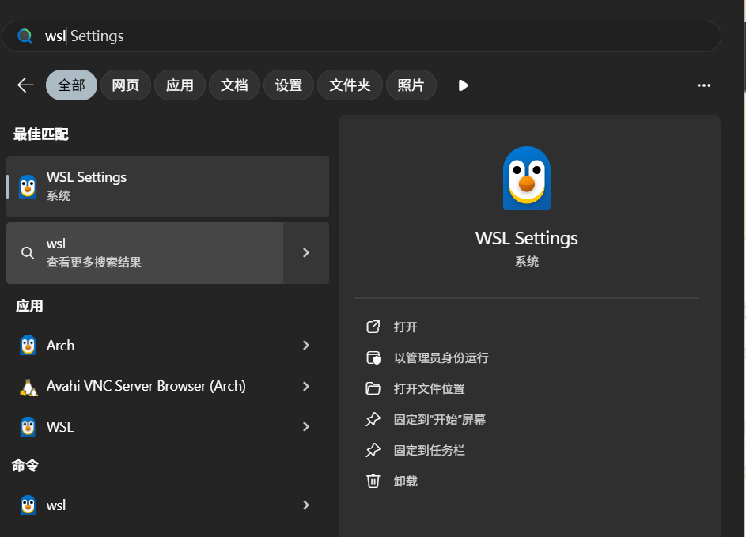

# wsl arch 2025

## 1 install  wsl
```bash
# 1 离线安装（推荐）
https://github.com/microsoft/WSL/releases/download/2.6.2/Microsoft.WSL_2.6.2.0_x64_ARM64.msixbundle
# 2 在线安装  速度较慢，不推荐
wsl --install

```
```bash
> wsl --version
WSL 版本: 2.5.10.0
内核版本: 6.6.87.2-1
WSLg 版本: 1.0.66
MSRDC 版本: 1.2.6074
Direct3D 版本: 1.611.1-81528511
DXCore 版本: 10.0.26100.1-240331-1435.ge-release
Windows: 10.0.26100.4946

> wsl --update
正在检查更新。
已安装最新版本的适用于 Linux 的 Windows 子系统。

# 将 WSL 默认版本设置为 WSL 2
wsl --set-default-version 2
```
## 2 powershell 管理员启动虚拟化
```bash
dism.exe /online /enable-feature /featurename:VirtualMachinePlatform /all /norestart
```

## 3 配置分发版本

我们使用ubuntu,具体的可以是ubuntu20.04,选择你需要的版本即可。下载分发系统一定要用官方的，它是带有支持图形界面功能的。

官方教程 http://learn.microsoft.com/zh-cn/windows/wsl/install-manual,正常是要通过 microsoft store来下载安装的，但这样安装会默认放到c盘，但如果两个系统都装在c盘，可能会不够用。如果有需要可以先安装在c盘，再迁移到其它盘，或都直接在其它盘安装。也有一个担心就是安装在其它盘，会无法使用图形界面。
2.3.1 下载发行版本

arch:

https://apps.microsoft.com/detail/9mznmnksm73x?hl=zh-CN&gl=CN  在线安装

https://github.com/yuk7/ArchWSL  github下载离线安装包

```bash
https://github.com/yuk7/ArchWSL/releases/download/25.3.19.0/ArchWSL-AppX_25.3.19.0_x64.appx
Add-AppxPackage .\Ubuntu.appx
```
## 4 wsl settings 设置




## 5 安装到D盘

#### 5.1.1 导出镜像

windows系统盘c盘可能很小，所以最好移动到其它盘，比如D盘。
 导出前无需关掉该镜像


#### 5.1.2 导入镜像

```bash
wsl --import <导入Linux名称> <导入盘的路径> <导入tar包路径> 版本(代表wsl2)
wsl --import Ubuntu1 D:\WSL1 D:\WSL1\ubuntu.tar --version 2
运行本项目bash12
```


导入盘的路径可以理解为安装的位置。可以看到文件夹下多一个ext4.vhdx文件夹：


接着查看当前所有的系统


如果要取消C盘安装：

可以执行：

```bash
wsl -t -d Ubuntu #或 wsl --shutdown
wsl --unregister Ubuntu
```

这里我们只保留c盘的。


此时vhdx文件会被删除。如果某一天C盘空间不够用，可以导出，移到其它盘。
 导入后，进入时是root用户，设默认用户参考https://blog.csdn.net/weixin_43408232/article/details/128606034

#### 5.1.3 默认系统设置及多系统选择

这时可以看到有两个。带*花的是默认系统，当输入“wsl"，后会启动该系统，否则，我们要启同的同的系统需要指定：

```bash
wsl -d Ubuntu1
运行本项目bash1
```

设置默认系统：

```bash
wsl --set-default Ubuntu1 # 或wsl -s Ubuntu1
运行本项目bash1
```

此后，在命令行中输入wsl即可启动Ubuntu1.

#### 5.1.4 vhdx文件导入

有时重装系统或者想把ext4.vhdx文件拿到其它机器上使用，那么可以直接导入vhdx文件，具体命令是：

```bash
wsl --import <导入Linux名称> <导入盘的路径>  版本(代表wsl2)
wsl --import-in-place ubuntu2004 D:\WSL\ext4.vhdx --version 2
运行本项目bash12
```

## 6 3、自动安装

上边这么多安装超级费事，更简单的方法是自动安装，这一步会把从2.1到2.3.2全部完成。总共也就三条命令。

### 6.1 查看分发系统并安装

```
wsl -l -o  # wsl --list --online
运行本项目1
```

这个是要联网的，查看都有那些系统：


安装我们需要的系统：

```
wsl --install -d Ubuntu-20.04
运行本项目1
```

啥也不用干，等着就行，完事就全部安装在c盘，安装过程也会有要求输入用户名和密码的环节。


安装完成后，无论是什么方法安装的，你就可以当做是一个新的装有linux系统的机器，该怎么配置就怎么配置。

## 7 4、安装windows终端

使用 Windows 终端可以打开多个选项卡或窗口窗格，以显示多个 Linux  发行版或其他命令行（PowerShell、命令提示符、Azure CLI 等）并在它们之间快速切换。  可使用独特的配色方案、字体样式、大小、背景图像和自定义键盘快捷键来完全自定义终端。这个终端与wsl关系不大，但安装后会使在使用wsl时更加方便。

按照[Windows 终端安装 | Microsoft Learn](https://learn.microsoft.com/zh-cn/windows/terminal/install)官网链接完成即可。**对于win11,默认就是用的这个，其实不用装，都自带了**。


可以看到集成了所有的命令行界面。

## 8 5、配置图形显示界面

如果你使用 Windows 11 Build 22000 以上版本，则可以使用 [WSL 2](https://so.csdn.net/so/search?q=WSL 2&spm=1001.2101.3001.7020) 提供的集成的桌面体验。该功能允许你直接安装并启动 Linux 桌面程序而无须其他配置。可以参看一下官网[使用 WSL 运行 Linux GUI 应用 | Microsoft Learn](https://learn.microsoft.com/zh-cn/windows/wsl/tutorials/gui-apps)。

基本不需要其它软件，要以和win自带的窗口一样来使用。剪切和粘贴也是可以通用。

如果是低版本的系统，不支持wslg,[WSL (Windows 10) - OI Wiki (oi-wiki.org)](https://oi-wiki.org/tools/wsl/#进阶操作)可以按照这个文章提供的方法，使用远程桌面的方式来进行访问。


可以看到当前我们的系统里有wslg的支持。

我用的win11，命令：

```bash
wsl --update
运行本项目bash1
```

这个命令后直接可以使用。

安装相关的图形界面的软件，就可以。

## 9 6、GPU使用

同上，执行完更新命令后这些都可以用了，目前我机器上只有一个显卡，不知道多显卡支持如何。

显卡驱动，就用windows上的，安装win11系统都自带了，要是没搞定，用个驱动精灵或nvidia官网，都可以安装。

```
nvidia-smi
运行本项目1
```


可以安装cudatoolkit,cudnn,pytorch,tensorflow等等，做算法开发。

## 10 7、文件互访

这个也很重要，虽然可以借助图形界面和nautilus可以访问，但毕竟wsl访问文件，还是差点。

### 10.1 复制粘贴

这部分我是觉的直接复制文本，可以在shell中互访，很方便，比如win用浏览器搜个ubuntu命令，可以直接贴过去

### 10.2 直接访问wsl文件

这个还是说通过win系统操作wsl的文件，但不能把文件给拷出来，这个就相当于是个远程桌面。

```
sudo apt install nautilus
nautilus
运行本项目12
```


### 10.3 wsl 访问 win

就在/mnt下，有c,d盘：


### 10.4 ７.4 win访问wsl

打开文件资源管理器，有个小企鹅，就是，这个是我觉的最好的互访方法。


## 11 8、指定用户

在实际使用中，无论是初始安装还是移动镜像，在一个新的环境下，原先的用户要么不能用或不存在，这时需要我们像使用一个新的ubuntu系统一样，来处理wsl中的用户，唯一不同是的要指定一下默认的用户。

### 11.1 新增用户

在WSL (Windows Subsystem for Linux) 中新增用户，可以按照以下步骤进行操作：

1. **打开WSL终端**：
    打开WSL终端，可以通过开始菜单搜索“WSL”或“Ubuntu”来启动。

2. **添加新用户**：
    在终端中输入以下命令来添加新用户，并将 `username` 替换为你想创建的用户名：

   ```bash
   sudo adduser username
   运行本项目bash1
   ```

   该命令将提示你输入并确认新用户的密码，并提供一些可选的用户信息（如全名、房间号等）。你可以直接按 Enter 跳过这些可选项。

3. **为新用户赋予管理员权限（可选）**：
    如果你希望新用户具有管理员权限，可以将该用户添加到 `sudo` 组：

   ```bash
   sudo usermod -aG sudo username
   运行本项目bash1
   ```

   这样，新用户将能够使用 `sudo` 命令来执行需要管理员权限的操作。

4. **切换到新用户**：
    使用以下命令切换到新创建的用户：

   ```bash
   su - username
   运行本项目bash1
   ```

   这将使你以新用户的身份登录到系统。

### 11.2 8.2为wsl指定用户

在WSL2（Windows Subsystem for Linux 2）的Ubuntu发行版中，你可以通过以下步骤来设置默认用户：

1. **打开Windows PowerShell**：
    按 `Win + X` 并选择 “Windows PowerShell”，或者通过开始菜单搜索并打开。

2. **设置默认用户**：
    使用 `wsl` 命令并带上 `-u` 选项来指定默认用户。以下是命令格式：

   ```powershell
   wsl -d <distro_name> -u <username>
   运行本项目powershell1
   ```

   例如，如果你的发行版名称是 `Ubuntu`，用户名是 `newuser`，那么命令将是：

   ```powershell
   wsl -d Ubuntu -u newuser
   运行本项目powershell1
   ```

这种方法每次输入都要通过-d指定系统，-u指定用户，还是比较麻烦的。
 **另一种方法：通过`wslconfig`命令设置**

要为 `ubuntu2004` WSL 发行版设置默认用户，可以按照以下步骤操作：

1. **打开 PowerShell 以管理员身份运行**：
    首先，您需要以管理员身份打开 PowerShell 窗口。

2. **启动 `ubuntu2004` WSL 发行版**：
    使用以下命令启动 `ubuntu2004` WSL 发行版：

   ```sh
   wsl -d ubuntu2004
   运行本项目sh1
   ```

3. **创建或切换到目标用户**：
    如果目标用户尚未创建，您可以在 `ubuntu2004` WSL 发行版中使用以下命令创建新用户（假设要创建的用户名为 `newuser`）：

   ```sh
   sudo adduser newuser
   运行本项目sh1
   ```

   按提示设置密码和用户信息。

4. **为 `ubuntu2004` 设置默认用户**：
    关闭 `ubuntu2004` 发行版，然后在 PowerShell 中运行以下命令设置默认用户：

   ```sh
   wsl -d ubuntu2004 -u newuser
   运行本项目sh1
   ```

5. **编辑 `wsl.conf` 文件**：
    确保在 `ubuntu2004` WSL 发行版中创建或编辑 `/etc/wsl.conf` 文件，以永久设置默认用户。打开 `ubuntu2004` 发行版并执行以下命令：

   ```sh
   sudo nano /etc/wsl.conf
   运行本项目sh1
   ```

   然后添加以下内容：

   ```ini
   [user]
   default=newuser
   运行本项目ini12
   ```

6. **重启 WSL**：
    关闭所有 WSL 实例，然后在 PowerShell 中运行以下命令重启 WSL：

   ```sh
   wsl --shutdown
   运行本项目sh1
   ```

这将为 `ubuntu2004` WSL 发行版设置默认用户为 `newuser`。下次启动 `ubuntu2004` 时，将以 `newuser` 用户身份登录。

## 12 9、网络配置

正常情况下，直接使用是没有问题的，但在某些情况，比如本地windows系统中使用代理，这时代理对wsl不生效；  或都连接远程服务器，windows可以登陆但wsl 不可以；或者电脑双网卡，一个上内网，一个上外网，路由配置很困难等等，总的来说是配置前  windows和wsl  是两个ip,但配置后，wsl与windows基本是一样的，对windows生效的对wsl同样生效，或都在默认网络情况下不工作，可以试一下。

### 12.1 配置.wslconfig

打开文件资源管理器，导航至 %UserProfile% 目录（通常是 C:\Users\你的用户名） 如果不存在，创建一个名为 .wslconfig 的新文件,随意一个文本编辑器都可以，加上以下内容：

```
[experimental]
autoMemoryReclaim=gradual  # 选择 gradual、dropcache 或 disabled
networkingMode=mirrored      # 设置为 mirrored 或 isolated
dnsTunneling=true            # 选择 true 或 false
firewall=true                # 选择 true 或 false
autoProxy=true               # 选择 true 或 false
sparseVhd=true               # 选择 true 或 false
运行本项目1234567
```

### 12.2 配置生效

重启wsl即可

```bash
wsl --shutdown
wsl -u your_user_name
运行本项目bash12
```

本节[参考](https://blog.csdn.net/m0_74280172/article/details/143025018?spm=1001.2014.3001.5506),可以自己看一下。

## 13 10、Docker安装

想很彻底的把wsl 当成一个系统使用，有时要用到Docker来安装各种环境
 **WSL2 完全可以安装并运行 Docker**，并且 **官方推荐**在 Windows 上运行 Docker 的方式就是通过 **Docker Desktop + WSL2**。

------

使用 Docker Desktop for Windows + WSL2

这是最简单、官方支持度最高的方法。

1. **开启 WSL2（你可能已经开启）**

   - Windows 功能中启用“适用于 Linux 的 Windows 子系统”和“虚拟机平台”

   - 安装 WSL2 内核：https://aka.ms/wsl2kernel

   - 默认 WSL 版本设为 2：

     ```powershell
     wsl --set-default-version 2
     运行本项目powershell1
     ```

2. **安装 Docker Desktop**（支持 WSL2 的版本）

   - 下载地址：https://www.docker.com/products/docker-desktop/
   - 安装时会提示你启用“WSL2 后端” ➜ 勾选它。

3. **在 WSL2 中启用集成**

   安装好 Docker Desktop 后，在它的设置中找到：

   > Settings → Resources → WSL Integration→ 选择你安装的Linux发行版本（如ubuntu)
   >  Settings ‌→ General → Use the WSL 2 based engine
   >  中途可能会要求重启

4. **测试**

   打开 WSL2（如 Ubuntu）终端，输入：

   ```bash
   docker run hello-world
   运行本项目bash1
   ```

   如果看到成功消息，说明你已在 WSL2 中成功运行 Docker。

5. **镜像安装**
    使用docker desktop 或使用命令 docker pull都是可以的

6. **nvidia docker的使用**

容器是可以直接使用显卡的
 测试命令：

```
docker run --gpus all -it --rm nvidia/cuda:11.8.0-base-ubuntu22.04 /bin/bash
运行本项目1
```

## 14 11、参考链接

[适用于 Linux 的 Windows 子系统文档 | Microsoft Learn](https://learn.microsoft.com/zh-cn/windows/wsl/)

[WSL (Windows 10) - OI Wiki (oi-wiki.org)](https://oi-wiki.org/tools/wsl/#外部链接)

[限制 WSL2 中 Vmmem 的内存占用 | 臭大佬 (choudalao.com)](https://www.choudalao.com/article/314)

https://zhuanlan.zhihu.com/p/466001838
 https://cloud.tencent.com/developer/article/1986728
 https://zhuanlan.zhihu.com/p/583002945
 ows/wsl/)

[WSL (Windows 10) - OI Wiki (oi-wiki.org)](https://oi-wiki.org/tools/wsl/#外部链接)

[限制 WSL2 中 Vmmem 的内存占用 | 臭大佬 (choudalao.com)](https://www.choudalao.com/article/314)

https://zhuanlan.zhihu.com/p/466001838
 https://cloud.tencent.com/developer/article/1986728
 https://zhuanlan.zhihu.com/p/583002945
 https://mmsig.openmmlab.com/general/env/win10wsl#er-wsl2-he-ubuntu22.04-linux-zi-xi-tong-de-xia-zai-an-zhuang
