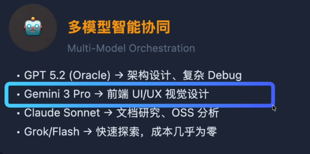

## 1 国内AI IDE
国内的AI IDE（集成开发环境）领域发展迅速，有不少优秀的产品正在崭露头角。以下是一些主要的#及相关平台：

### 1.1 阿里云 - 通义灵码【Lingma ide】	 ⭐⭐⭐
较为慷慨。<span style="background-color: green">个人开发者完全免费</span>；<mark style="background-color: red；color: black">企业版在一定额度内免费</mark>。	
Qwen-Coder (通义千问代码模型) / 通义大模型体系	
1. 功能全面：代码补全、解释、注释、调试、优化、单元测试生成一应俱全。	1. 对非阿里系技术栈的支持可能不如通用型工具。
2. 中文优化好：对中文注释和需求理解准确。	
3. 部分高级功能（如深度代码分析）可能需要付费或更高版本。
4. 生态集成：与阿里云、钉钉、蚂蚁生态工具链结合紧密。	
### 1.2 百度 - Comate	[vscode插件] ⭐⭐
提供免费额度。个人开发者有足够日常使用的免费额度，超出需付费。	
ERNIE-Code (文心代码大模型)	
1. 代码生成能力强：尤其在百度主推的框架（如PaddlePaddle）和AI场景下表现突出。	
2. 免费额度存在限制，重度使用者可能触及上限。
3. 符合国内习惯：代码风格和命名习惯更贴合国内开发者。	
4. 在非百度生态的特定技术栈上可能表现不突出。
5. 安全可控：企业版支持代码隐私和模型私有化部署。	
### 1.3 智谱AI - CodeGeeX [vscode插件] ⭐⭐
完全免费开源。插件和基础模型可免费使用，无商业限制。	
CodeGeeX (自有开源模型)	1. 完全免费开源：对个人和商业友好，无后顾之忧。	1. 能力上限相对较低：相比顶级闭源大模型，代码生成质量和智能度有差距。
			5. 多语言支持广：支持100+编程语言，覆盖广泛。	2. 功能相对基础，主要集中在代码生成和补全。
			6. 开源可定制：代码开源，技术团队可自行部署和微调。	
### 1.4 腾讯云 - Cloud Studio [在线编程] ⭐
提供免费 workspace。有每月固定时长的免费额度，配置较低。	
Hunyuan-Code (混元代码大模型)	
1. 开箱即用的云端IDE：无需配置本地环境，浏览器即用。	
2. 本质是云端环境：AI辅助编程是其功能之一，非纯粹的AI编程助手插件。
3. 协作与分享便捷：内置多人实时协作、项目分享功能。	
4. 免费额度配置较低，大型项目可能跑不动。
5. 集成腾讯云服务：方便部署到云函数、容器等。	
6. 支持复杂逻辑生成：在生成业务逻辑代码方面有一定优势。	
7. 免费策略不够清晰和长期稳定。
### 1.5 Kimi (月之暗面)	【cli工具】
https://github.com/MoonshotAI/kimi-cli
Kimi Code CLI 目前处于技术预览阶段，功能和 API 可能会发生变化。如果你遇到问题或有建议，欢迎在 [GitHub Issues](https://github.com/MoonshotAI/kimi-cli/issues) 反馈。
对话免费。通过网页或App对话形式提供，有免费额度（目前较宽松）。	
Moonshot AI (自研Moonshot模型)	
1. 超长上下文：支持128K/200K乃至更长上下文，适合分析整个项目代码库。	
2. 非IDE集成：需要手动复制粘贴代码，开发流程不连贯。
3. 优秀的文档处理能力：能上传并理解技术文档、API手册等。	
4. 不直接生成可执行代码块：主要以文本和建议形式输出。
5. 纯粹的对话助手：作为编程“外脑”，适合分析、解释、设计讨论。	

## 2 国外
### 2.1 claude cli
### 2.2 opencode cli
### 2.3 cursor ide
- **类型**：独立AI IDE（基于VS Code分支）
    
- **所属**：Anysphere（美国初创公司）

### 2.4 **GitHub Copilot X**​

- **类型**：IDE插件（集成于VS Code、JetBrains等）
    
- **所属**：GitHub（微软旗下）
### 2.5 Amazon CodeWhisperer​

- **类型**：IDE插件（集成VS Code、JetBrains、AWS Cloud9等）
    
- **所属**：亚马逊AWS
### 2.6 kiro ide 亚马逊

## 3 oh-my-opencode
```text
npx oh-my-opencode install
```
