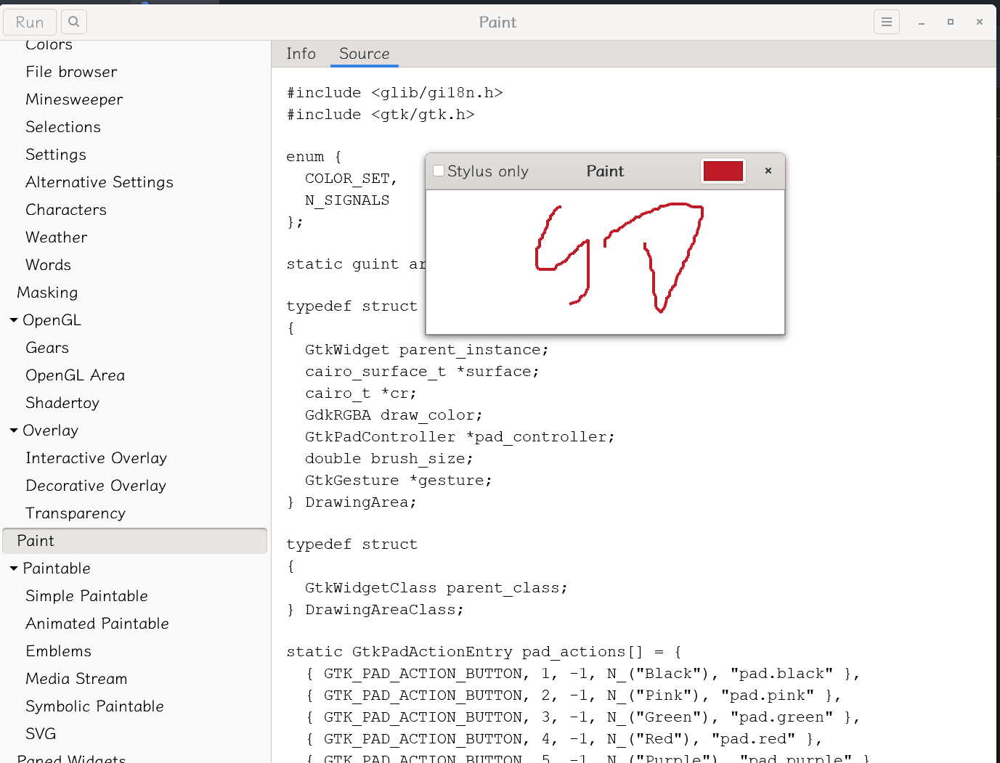
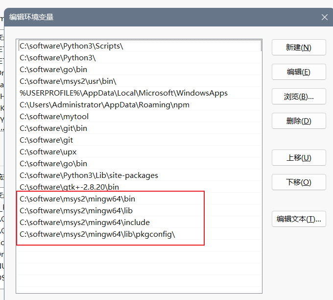
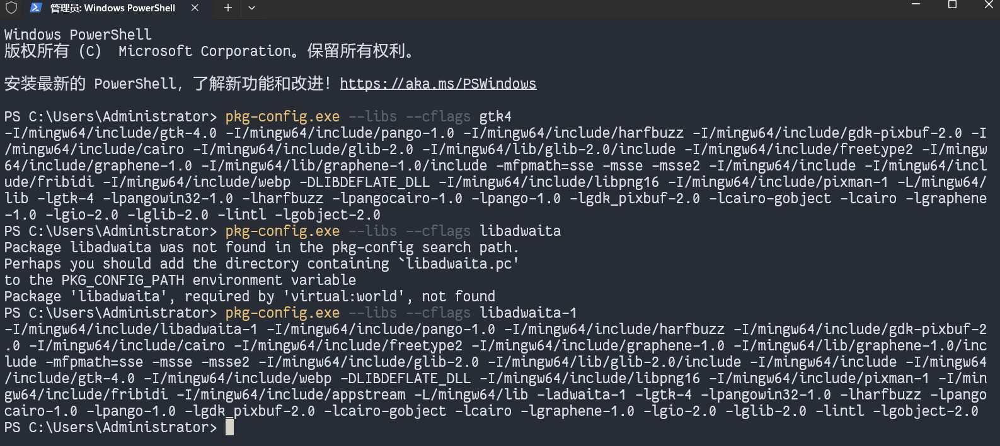
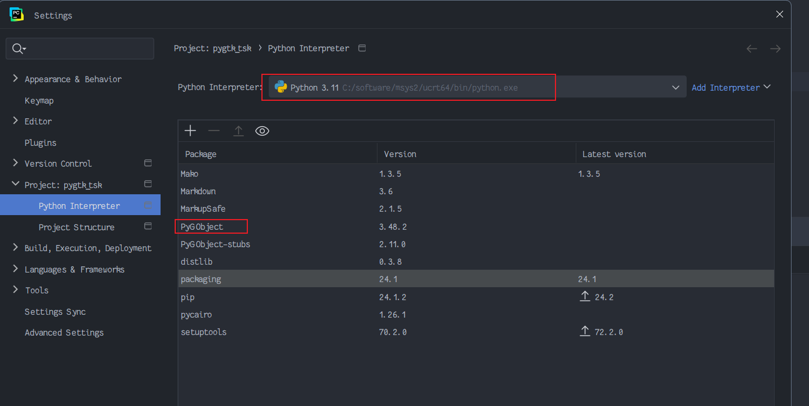
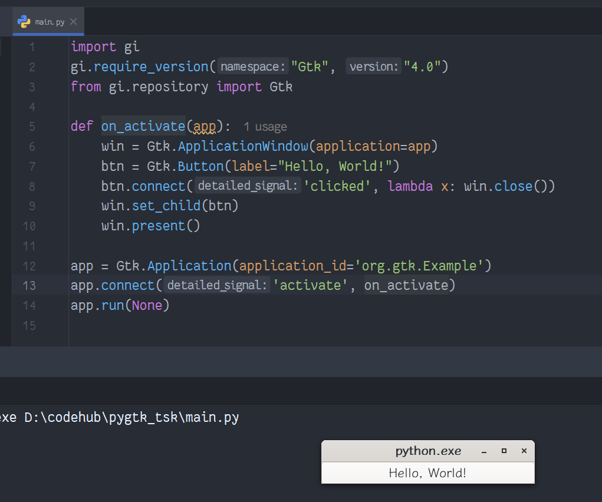
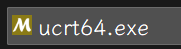
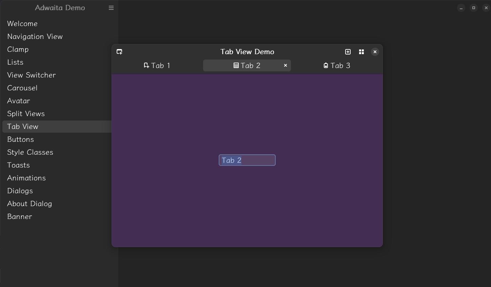
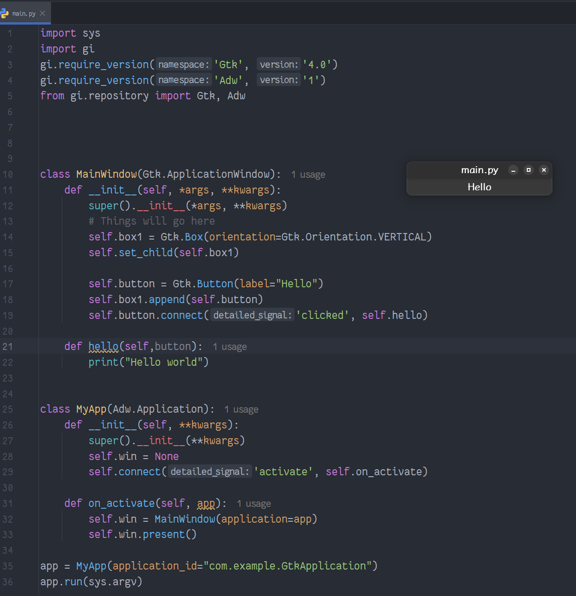

# 搭建Windows GTK环境+pyGTK使用

[toc]


## 搭建Windows GTK环境
[GTK and Python教程 ](https://www.gtk.org/docs/language-bindings/python/)

> 注意：这些说明适用于希望创建基于 GTK 的 Windows 应用程序的开发人员，而不是最终用户。在 Windows 上，GTK 应用程序通常已经与 GTK 捆绑在一起，因此最终用户无需担心如何安装 GTK 本身。 

在 Windows 开发机器上安装 GTK 有多种方法。 

- [MSYS2](https://www.gtk.org/docs/installations/windows/#using-gtk-from-msys2-packages)
  - 此方法基于  [MSYS2 提供的包，MSYS2 ](https://www.msys2.org/) 为 Windows 提供了类似 UNIX 的环境。这两个仓库还为大量其他有用的开源库提供了包。 
- [gvsbuild](https://github.com/wingtk/gvsbuild)
  - 此方法提供了从源代码构建 GTK 堆栈的脚本，并输出可供 Visual Studio 或基于 Meson 的项目使用的库和工具。 

我们假设您使用的是 Windows 7 或更高版本。对于旧版本的 Windows，您将需要对旧版本的 GLib 和 GTK 进行自定义构建。 

### 使用 MSYS2 包中的 GTK                 

  [MSYS2 ](https://msys2.github.io/) 项目为 Windows 提供了一个类似 UNIX 的开发环境。它为许多软件应用程序和库提供包，包括 GTK 堆栈。如果更喜欢使用 Visual Studio 进行开发，则应改用 gvsbuild。 在 MSYS2 中，软件包是使用  [pacman 软件包管理器 ](https://github.com/msys2/msys2/wiki/MSYS2-installation#iv-general-package-management)安装的。 

#### 安装msys2

- MINGW: i686, x86_64, ucrt64, clang64
- MSYS: i686, x86_64

1. 请访问镜像目录下的 `distrib/` 目录

```
# x86_64
https://mirrors.tuna.tsinghua.edu.cn/msys2/distrib/x86_64/
# i686
https://mirrors.tuna.tsinghua.edu.cn/msys2/distrib/i686/
```

找到名为 `msys2-<架构>-<日期>.exe` 的文件（如 `msys2-x86_64-20141113.exe`），下载安装即可。

#### pacman 的配置 直接运行

```bash
sed -i "s#https\?://mirror.msys2.org/#https://mirrors.tuna.tsinghua.edu.c

pacman -Syu  # 更新源
```

### 安装gtk4

> 注意：在以下步骤中，我们假设您正在使用  `64-bit Windows`。因此，包名称包括 x86_64 体系结构标识符。如果您使用的是 32 位 Windows，请使用 i686 架构标识符调整下面的说明。 

1. 下载 [与您的平台匹配的 MSYS2 安装程序 ](https://www.msys2.org/)，并按照安装说明进行操作。 ，配置源https://mirrors.tuna.tsinghua.edu.cn/help/msys2/等操作
2. 安装 GTK4 及其依赖项。打开 MSYS2 shell，然后运行： 
```bash
pacman -S mingw-w64-ucrt-x86_64-gtk4
# 如果您想使用 GTK3 进行开发，请运行：  pacman -S mingw-w64-ucrt-x86_64-gtk3
```

C:\software\msys2\ucrt64\bin\gtk4-demo.exe

3. 如果你想用 C、C++、Fortran 等开发 GTK 应用程序，你需要一个像 GCC 这样的编译器及其工具链： 
```bash
 # c c++  编译工具链和gcc
pacman -S mingw-w64-ucrt-x86_64-toolchain base-devel  mingw-w64-ucrt-x86_64-gcc   

# 如果你想用 Python 开发一个 GTK 应用程序，你需要安装 Python 绑定：
	# 注意：这里的mingw-w64-ucrt-x86_64-前缀是针对64位Windows系统的，如果你的系统是32位的，可能需要使用mingw-w64-i686-前缀。
pacman -S mingw-w64-ucrt-x86_64-python3  mingw-w64-ucrt-x86_64-python3-pip  # 安装python和pip
pacman -S mingw-w64-ucrt-x86_64-python-gobject  
	

# 如果你想在 Vala https://vala.dev/ 中开发一个 GTK 应用程序，你需要安装 Vala 包： 
pacman -S mingw-w64-ucrt-x86_64-vala
```

4. 配置环境变量，如果是C、C++等语言时：
    

5. 验证是否安装成功，使用powershell

    


### 构建和分发应用程序                 

一旦你安装了如上面的GTK，你编译GTK应用程序应该没有什么问题。为了成功运行它，您还需要一个 GTK 主题。GTK 中有一些对 Windows 主题的旧内置支持，但这使您的应用程序看起来像 Windows 7 应用程序。最好获取  Windows 10 主题，例如  [Windows 10 Transformation Pack ](https://github.com/B00merang-Project/Windows-10)。 

**步骤 1。**  将 Windows 10 转换包存储库中的图标资源复制到安装文件夹下的 `share/themes/Windows10`： 

- 对于 GTK4 资源，请复制  `gtk-4.0` 文件夹下  `share/themes/Windows10/gtk-4.0`
- 对于 GTK3 资源，请复制  `gtk-3.20` 文件夹下  `share/themes/WIndows10/gtk-3.0`

**第2步。**  您还需要从 Adwaita 主题中复制图标，您可以从  [GNOME 源 ](https://download.gnome.org/sources/adwaita-icon-theme/)下载。 

**第 3 步。**  对  [`hicolor`](https://www.freedesktop.org/wiki/Software/icon-theme/) 图标，这是 Adwaita 中不可用的图标的强制性回退。 

**第 4 步。**  要让 GTK 选择这个主题，请放置一个文件  `settings.ini` 在  `etc` 安装文件夹中的文件夹： 

- 对于 GTK4，请使用  `etc/gtk-4.0/settings.ini`
- 对于 GTK3，请使用  `etc/gtk-3.0/settings.ini`

这  `settings.ini` 文件应包含： 

```
[Settings]
gtk-theme-name=Windows10
gtk-font-name=Segoe UI 9
```

**第 5 步。**  最重要的是，运行  `glib-compile-schemas` GLib 提供的实用程序，用于在安装文件夹中生成编译的设置模式： 

```
glib-compile-schemas share/glib-2.0/schemas
```

**第 6 步。**  然后，您可以压缩安装文件夹，或使用安装程序生成器为您执行此操作，并分发结果。 

您可以使用 MSYS2 来 [构建您的 GTK 应用程序，并创建一个安装程序来分发它 ](https://blogs.gnome.org/nacho/2014/08/01/how-to-build-your-gtk-application-on-windows/)。您的安装程序将需要提供您的应用程序构建工件以及 GTK 二进制文件和运行时依赖项。 

#### 关于将 GTK 与应用程序一起分发的法律说明                 

欢迎您在其他网站、CD-ROM 和其他媒体上重新分发 GTK 二进制文件，包括将它们捆绑在一起的应用程序。您无需征得许可。这是自由软件的重点之一。 

要求的一件重要事情  [GNU 许可证 ](http://www.fsf.org/licenses/licenses.html) 是，您还必须根据要求重新分发源代码。这通常至少意味着 gettext、GLib、GTK、Pango 和 ATK 源。 


## 验证安装
安装完成后，你可以通过编写一个简单的Python脚本来验证PyGObject是否成功安装。例如，创建一个名为hello.py的文件，内容如下：

### 选择pycharm打开，interpreter选择ucrt中的python



```python
import gi  
gi.require_version('Gtk', '4.0')  # 或者使用 '3.0' 如果你安装的是GTK+ 3  
from gi.repository import Gtk  

class HelloWorld(Gtk.ApplicationWindow):  
    def __init__(self, *args, **kwargs):  
        super().__init__(*args, **kwargs)  
        self.set_title("Hello World")  
        self.set_default_size(200, 200)  

        label = Gtk.Label(label="Hello, PyGObject!")  
        self.add(label)  

if __name__ == "__main__":  
    app = Gtk.Application(application_id="org.example.HelloWorld")  

    app.run(HelloWorld())

在MSYS2终端中，运行该脚本：

bash

python3 hello.py
```



## Step3 配置Gtk本地环境

输入代码（注意Gtk文件所在位置）：

> pkg-config --cflags gtk4

## GTK4 + Adwaita



安装adwaita:`pacman -S mingw-w64-ucrt-x86_64-libadwaita`

安装adwaita,使gtk显示现代扁平的主题

C:\software\msys2\ucrt64\bin\adwaita-1-demo.exe



```python
import sys
import gi
gi.require_version('Gtk', '4.0')
gi.require_version('Adw', '1')
from gi.repository import Gtk, Adw


class MainWindow(Gtk.ApplicationWindow):
    def __init__(self, *args, **kwargs):
        super().__init__(*args, **kwargs)
        # Things will go here

class MyApp(Adw.Application):
    def __init__(self, **kwargs):
        super().__init__(**kwargs)
        self.win = None
        self.connect('activate', self.on_activate)

    def on_activate(self, app):
        self.win = MainWindow(application=app)
        self.win.present()

app = MyApp(application_id="com.example.GtkApplication")
app.run(sys.argv)
```



## api查询

[PyGObject API Reference](https://lazka.github.io/pgi-docs/main.html)

gtk api：https://docs.gtk.org/gtk4/#interfaces

PyGTK4-Tutorial https://github.com/ren-chon/PyGTK4-Tutorial
