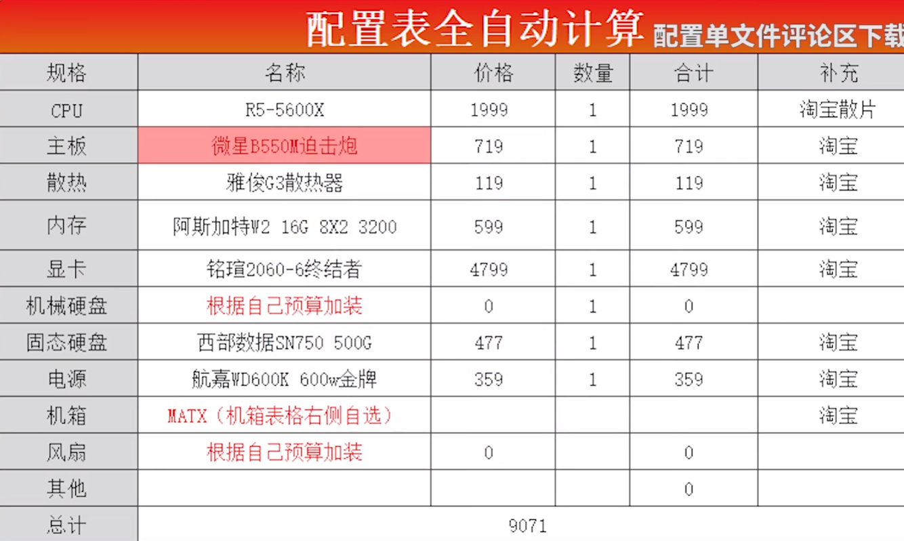
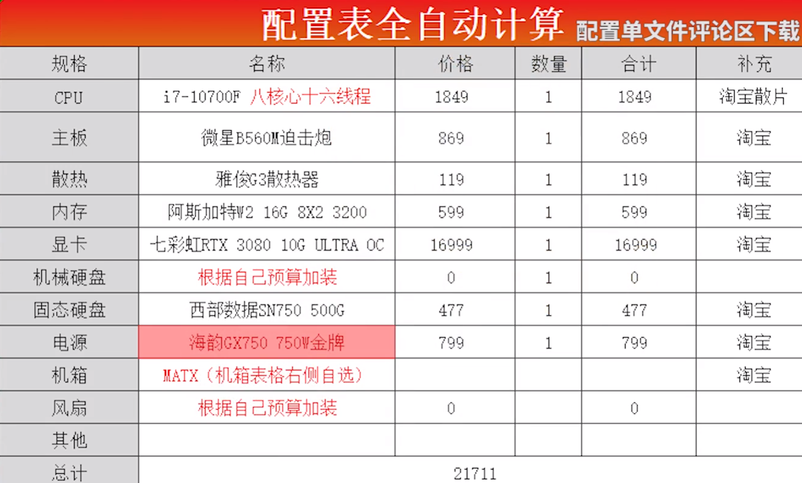
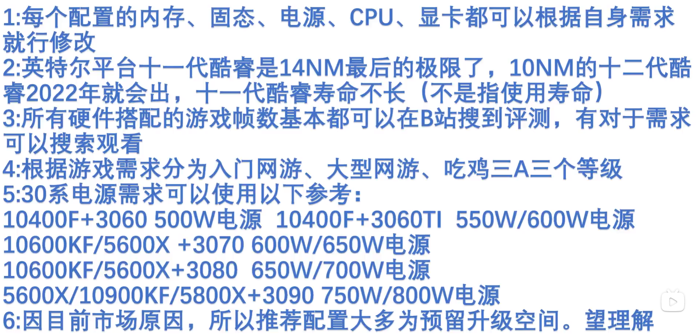
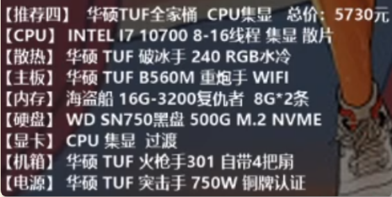
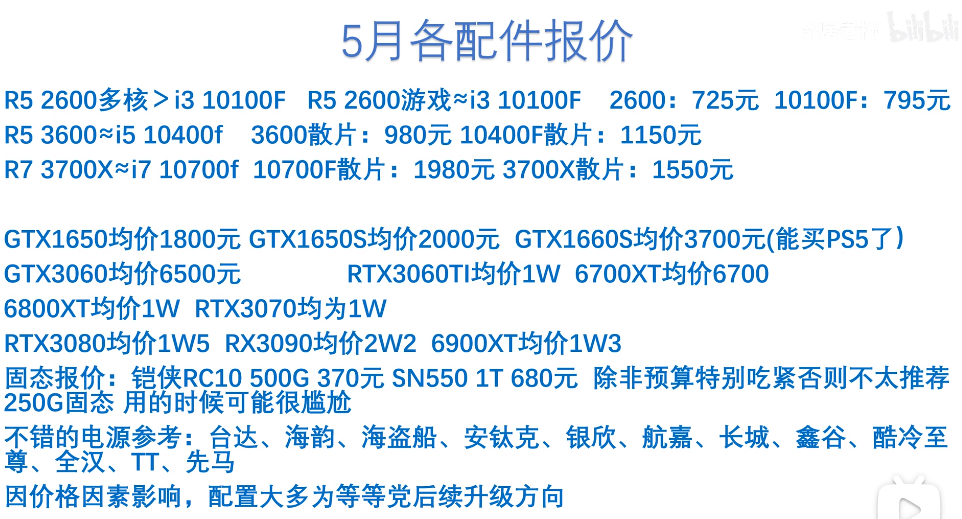
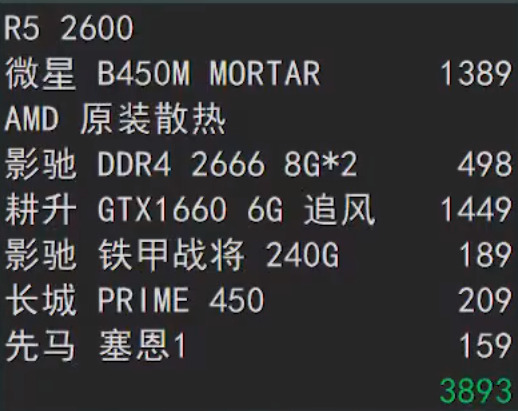
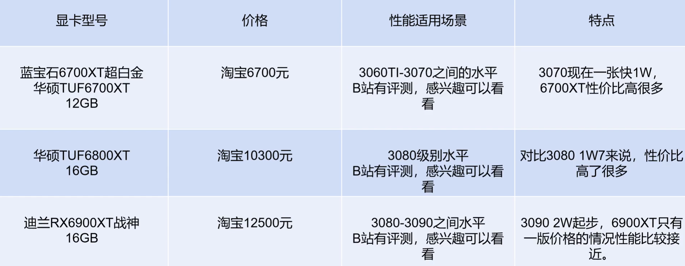
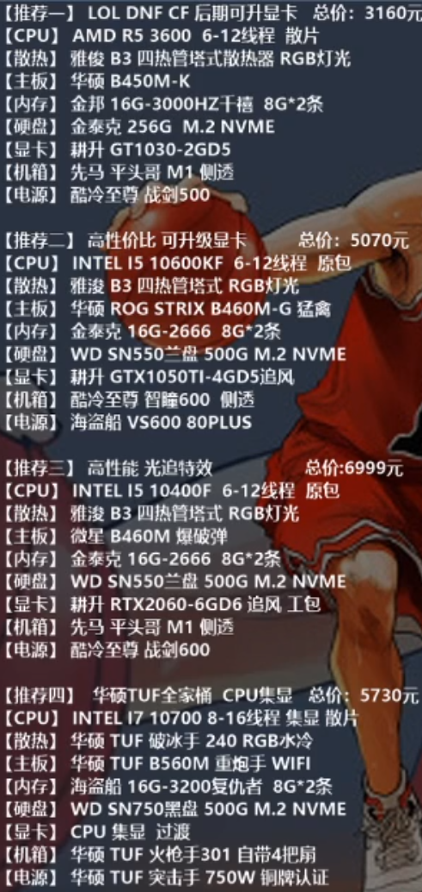

```shell

cpu：5800x  | i7 10700f ==R7 3700x|i5-11600KF
散热：雅俊B3(85)|雅俊G3(115)
风扇:不了解
主板：微星迫击炮-b550m wifi |技嘉雪雕B560M |华硕B450重炮手s (2050)|华硕B550重炮手 (2700)
内存：金士顿骇客神条16gx2 3600频率   | 芝奇幻光戟8g×2 3200频率 |铭瑄ddr4 8g 频率2666   | 镁光3200频率(C9BJZ) 8g*2 600
显卡：amd6900xt | 影驰1070骨灰大将8G|七彩虹 GT1650s (2150)|蓝宝石6700XT超白金 华硕TUF6700XT 6700元 |3060TI 3070 |华硕TUF6800XT 10500元|华硕TUF6900XT 13000元
硬盘：西数sn750 1t x2 |西数sn750 500g	|西数sn550 1T(730) |1T西数机械|凯侠RC10 500g 370元	
电源：长城猎金1100w金牌全模组 |酷冷至尊GX650|技嘉750W|先马金牌650W(350)
机箱：100
```









