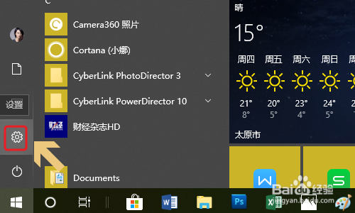
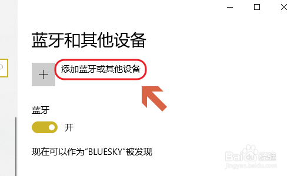

# 电脑如何连接蓝牙音箱播放音乐？听语音

**蓝牙音箱作为音频的重要输入设备，受到了很多年轻人的喜爱，尤其是爱好音乐的朋友更是离不开它，刚刚购买了一台蓝牙设备以后，应该如何将其与电脑连接起来呢？当然蓝牙音箱的种类也很多，没有统一的连接方法，下面小编介绍最常规的蓝牙音箱连接电脑的方法...**

## 工具/原料

-   蓝牙音箱
-   笔记本电脑

## 方法/步骤

1.  1

    使用过蓝牙音箱的朋友都知道，所有的蓝牙音箱开关处都有一个蓝牙图标，只有将开关调到这个图标的位置，才算是打开了蓝牙功能，如下图所示...

    

2.  [2](http://jingyan.baidu.com/album/6dad5075521bc5a123e36ee6.html?picindex=2)

    [接着我们需要在电脑端寻找这个蓝牙设备了，首先点击开始菜单，然后在左侧列表中找到“设置”，点击之后在Windows设置页面里点击“设备”这一项；](http://jingyan.baidu.com/album/6dad5075521bc5a123e36ee6.html?picindex=2)

    

    

3.  [3](http://jingyan.baidu.com/album/6dad5075521bc5a123e36ee6.html?picindex=4)

    [然后就切换到了电脑中的蓝牙开启界面，一般来说蓝牙默认都是关闭着的，手动将其打开即可，如图所示...](http://jingyan.baidu.com/album/6dad5075521bc5a123e36ee6.html?picindex=4)

    

4.  [4](http://jingyan.baidu.com/album/6dad5075521bc5a123e36ee6.html?picindex=5)

    [打开开关之后，点击该页面最上方的“添加蓝牙或其他设备”，在添加设备界面选择“蓝牙”，如图二；](http://jingyan.baidu.com/album/6dad5075521bc5a123e36ee6.html?picindex=5)

    

    

5.  [5](http://jingyan.baidu.com/album/6dad5075521bc5a123e36ee6.html?picindex=7)

    [系统会有几秒钟的设备搜索时间，然后就会显示搜索到的蓝牙设备了，图一就是小编刚才开启的蓝牙音箱设备，点击该设备名称，即可自动建立连接了；](http://jingyan.baidu.com/album/6dad5075521bc5a123e36ee6.html?picindex=7)

    

    [END](http://jingyan.baidu.com/album/6dad5075521bc5a123e36ee6.html?picindex=9)

## 注意事项

-   以上经验由作者redfox08总结整理，欢迎关注！