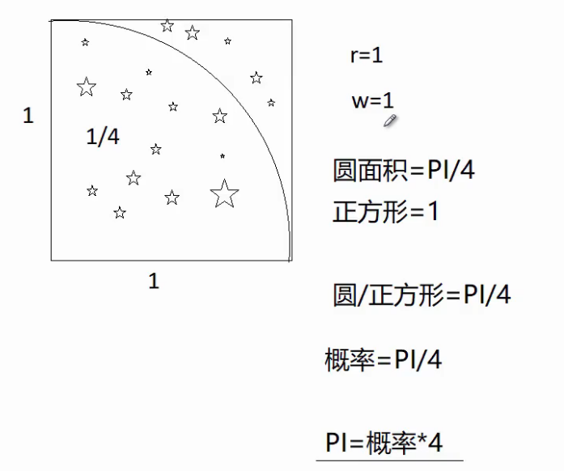

# 蒙特卡罗方法

[toc]


## 1 工作原理

1. 不断抽样

2. 逐渐逼近

计算pai



## 2 应用

PI=概率*4

```python
import random
total=5
in_cout=0
for i in range(total):
    x=random.random()
    y=random.random()
    dis=(x**2+y**2)**0.5
    if dis<=1:
        in_count+=1
        
 print("兀是："，4*in_count/total)

```


### 2.1 计算logo特殊形状的面积（白色面积占多少）

200*200像素


9157